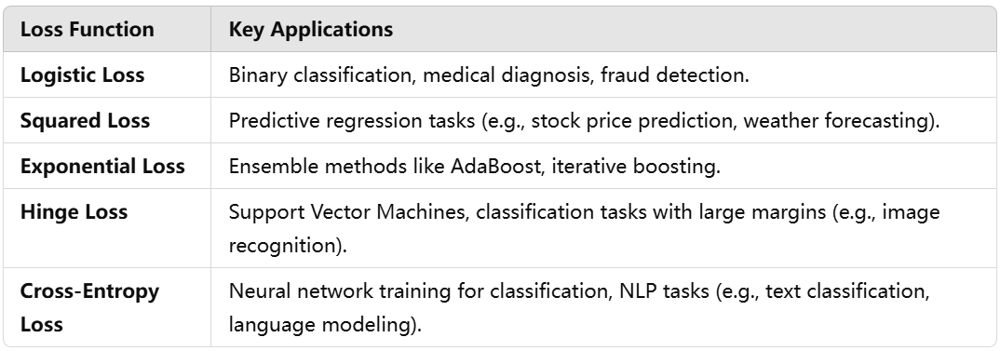
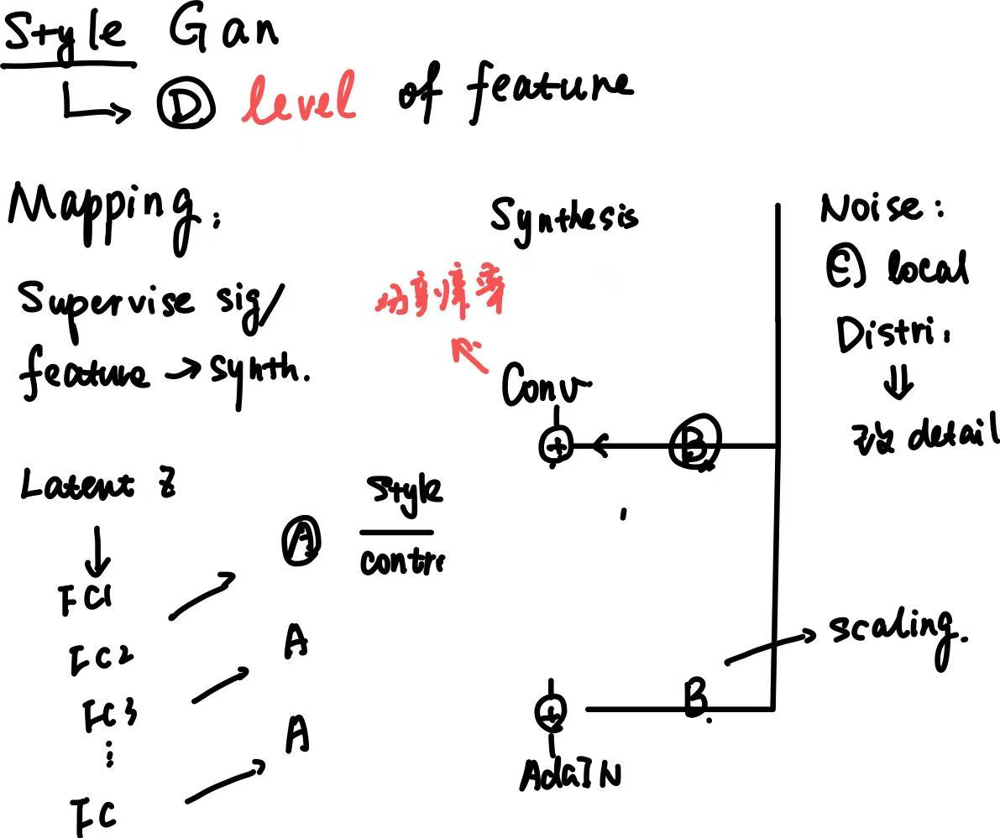
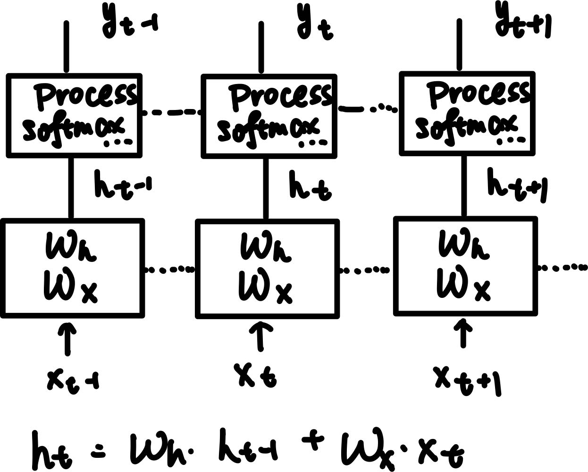

## Machine Learning


### Common model 


**Regression ⇒ Suppose data be ****linear**


- Deal with ood: hard 
    - RANSAC: train a small subset data each time and finetune the parameters iteratively

**SVM vs Regression**


- loss 
    - Maximize margin + panalty for misclassification 
    - Binary loss


    - Multi class 


    - Combine maximize margine + margin violation 
    - C: larger C ⇒ more panalty for outliers ⇒ harder margin


**Probabilities model**

- Gaussian Discriminant Analysis
    - assumes the features ** Gaussian distribution**

- Baysian Naive
    - Conditional independence
```math
P(x | y = c_i) = \prod(x_i | y = c_i) \\ P(\hat{y_{c_i}} | x) <= P(x | y) * P(y)
```


    - Training:  compute class priors and probabilities

- MAP 
    - Choose a likelihood / distribution of data of parameters theta
    - Estimate theta


**Unsupervised**

- K-means
    - min intra cluster variance
    - sensitive to initialization / hyper parameters 
    - Iterative optimization center of cluster

- Gaussian Mixture model
    - Assume mixture of multiple gaussian model 
    - Hard mask em 
    - Different gaussian parameters 

- PCA 
    - Compress data ⇒ decrease dimensions / jilter 
    - Project the data to lower dimension use the projection that
        - Reconstruct loss less ⇒ Contain most useful
        - Maximize variance


**Boosting **

- ensemble learning with multiple** weak learners**
- Training
    - Iteratively training
        - Adaboost: iteration T times and each time optimizing one weak classifier 
        - Gradient: more general: first compute the gradient based on **chosen loss, then optimizing one** 
        - 


**Other model**

- Decision Trees
    - splits the data recursively based on feature values
        - node represents a decision rule
        - leaf represents a predicted output

    - Train
        - Each step split the data based on evaluation matrices 


- Random Forests
    - Learn an **ensemble of trees **
        - each tree: a subset of instances and features

    - Two key points
        - Bootstrapping: estimate the **distribution of data**
            - each time sample a subset from main 
            - compute their **statistic features**
            - Aggreget through all samples 

        - bagging
            - How to aggregate results of bootstrap
                - classification: voting
                - regression: averaging 


    - Train
        - Bootstrap samples ⇒ train separate tree ⇒ aggregate results + an extra tree


- HMM hidden markov model 
    - Learn parameters with observesd **sequence**
    - Estimate state pridiction or sequence based on prob


### Loss 


- convex





### Evaluation


- precision vs recall vs acc
    - acc: true positive
    - recall false negetive: must detect **all negetive samples **
        - cancer detection

    - precision: false positive
        - spam email 

    - F-score: balance of precision and recall 

- AUC
    - Used on **inbalanced dataset**

- Log-Loss: probabilities are important 


### Distance matrices


### Other related questions 


- Why extract data
    - Reduces Overfitting
    - Reduces Computational Cost
    - Focuses on Domain-Relevant Features

- EM : find the maximum likelihood estimates of parameters
    - Gaussian Mixture Models
    - Hidden Markov Models
    - 𝑄(the** approximate distribution**) differs from another 𝑃 (the **target distribution**)

- Graphic based: uses a graph to represent the conditional dependence structure between random variables
    - HMMS: only Encodes pairwise relationships
    - Encodes causal relationships using directed edges.

- dimensionality redunction
    - PCA
    - ICA
    - encoder

## Basic deep learning


- difference with traditional ML
    - Data: large scale + raw data vs extracted features
    - parameters: super large vs small 
    - interpretability: black box vs known 

### Formula


```math
softmax: \frac{e^x_i}{\sum_{j} e^x_j}
```


```math
sigmoid: \frac{1}{e^{-x} + 1}
```


```math
leaky \; relu: kx (x <= 0), x(x > 0)
```


```math
Contrsative \; Loss \; = (1 - y)d^2 + ymax(0, margin -d)^2
```


```math
Norm = \gamma\frac{x-\mu}{\sigma + \epsilon} + \beta
```


```math
batch \; normalization:x_i = \frac{x_i - \mu_{batch}}{\sqrt{\sigma_{batch}^2 + \epsilon}}
```


### Training


**Gradient explosion: Too large weight**

- smaller lr 
- gradient clipping
- batch normalization
**Gradient vanishment: too small gradient**

- bad activation, vanish exponentially like sigmoid ⇒ ReLU
- Too small weight ⇒ batch normalization
- weight initialization 
- residual
**Initialization**

- Initialize the **bias + weight **based on the **structure + non linearity **
- How to initialize: always based on `fan_in` `fan_out` ⇒ the larger the fan, the smaller the initialize value 
- Normal case
    - If use **ReLU as activation ** + CNN / Linear: `kaiming_normal_` 
    - If use **Sigmoid / tanh **as activation ⇒ `xavier_uniform_` 
    - bias: `zero_`

- Special case: transformer related always normalized as `mean=0, std=0.02`
**Activation**

**Sigmoid**

**ReLU**

**Leaky ReLU **

**GeLU **

- Gaussian Error Linear Unit: smooth, non-linear activation
- Solved
    - Zero gradient < 0
    - **sharp discontinue**

- Used in 
    - Transformer structure

- Why solved
    - the gradient is more stable: bounded and never **close 0**

- But: **too complex**


**SiLU: Sigmoid Linear Unit**

- smoother version of ReLU 
- Solved: Like GeLU
- How and why: similar to GeLU but easier to compute 


**Regularization**

**L1**

- abs(wi)
- sparse ⇒** some wi may ⇒ 0**
- Not stable 
- Feature selection
**L2**

- wi^2
- generalization 
**Normalization**

All normalize follow 

```math
normalized = scale * norm(x) + shift
```


Among them, 

- `scale` + `shift` ⇒ trainable parameters 
- norm is normalized in dfferent way
- Always use **`zero-initialzation`**** **: the training will follow `linear` → `unlinear` make training easier


- Batch norm
    - standarization dynamically along each **channel **⇒ during normalization, the variance and mean is `(1, C, 1, 1)` 
        - Mix info of each batch of each map
        - not mix the info among channel ⇒ each channel has different info 

    - Cons
        - More stable training: keep to **Gaussian ⇒ ** Even **Faster **training 
        - learnable parameters        


- Layer Norm
    - dynamically in the whole layer ⇒ one dimension is used for compute 
    - Always used in transformer-based structure 

- AdaLayer Norm 
    - The `scale` and `shift` is not learnable, but provided by **control signal from input **
    - The control signal can be **embedded and control the training **
    - E.g
        - Diffusion: time emb + shape emb ⇒ control step generation 
        - Video DiT-diffusion: text emb ⇒ control generation                       


### Optimization


**Adam **

1. Why Adam: change `lr` for every parameters ⇒ use gradient but combine with `previous gradient` ⇒ **record by momentum **
1. Advantages, disadvantages?
    - Advantages: 
        - more stable especially in **early stage**
        - less effort in tuning parameters 

    - Disadvantage
        - May overfit: can not generalization completely fit to the change of training data


1. How to compute
    1. two momentum
        1. mean gradient momentum: mean of gradient 
        2. variance of momentum: squared gradient

    2. Use two momentum to balance


### Convolution Layer 


- output size `(H + padding * 2 - dilated * (kH - 1)) // stride` 
- Receptive Field
    - region of the input image that **affects its output**
    - Shows **how much context **a filter influences 
```math
Receptive \ Field_i = RF_{i - 1} + (kernel_{i} - 1)\prod \limits_{j = 0}^{i - 1} stride_j \cdot dilated_i \\ Typically, stride,dilated=1 => RF_i = 1 + \sum \limits_{j=0}^{i}kernel_j - 1
```


- UnFolded convolution: more hardware frinedly convolution: instead of **moving sum**, use a **one-time computation **
    - flatten input = `unfold(tensor, kernel_size, stride)` 
    - After unfold the input, the size will be `C_in * kH * kW, out_H*out_W` 
    - So the two can be multipled together directly 
    - It is more friendly to hardware to compute all at once

- Dilated convolution: 
    - The used filters have **holes **that will skip the value of some pixels 
        - After each pixel, `dilated -1` pixels are skipped 

    - Used to **increase receptive field**


### VAE(Variational auto encoder)


Used to transform input to a more **compressed, lower rank, faster **latent space Z 

Typically, simply go to encoder ⇒ decoder, but actually we will add **reparameterization Trick **

- Latent: better follow `N(u, sigma)` 
- To confirm latent in **Gaussian Distribution**, need to **resample from Gaussian Distribution **
    - Resample from **another Gaussian Distribution instead of construct one ** makes training more stable 
    - Use **linear reflection to compute avg and var **
    - To confirm stable sigma, the `log var` is recorded ⇒ when compute variance, exp(log var) can confirm the variance always  be **positive ⇒ **During bp, it is possible that var becomes negetive 
```math
z \; sample \; from \; N(\mu_x, \sigma_x^2)
```


### Gan


Use descriminator and generator to do a **adversarial game **


**Problem**

- model collapse 
    - Phenomenon 
        - only generate part of data
        - Can not capture all distribution

    - Reason 
        - Gan loss function ⇒ MSE is not enough 
        - **D learns slow** ⇒ G can “cheat” D without complex learned knowledge 
        - oscillatory behavior ⇒ not stably converge 

    - Solution
        - Mini-batch evaluation: use **D to use batch of samples **
        - Different loss: wassertein Gan
        - regularization: gradient penalty / normalization (spectral)


- Unstable and sensitive: will be influenced both by **G and D **
- If **D is too strong:** no gradient for G(z) because it is nearly 0


Evaluation 

- FID: difference real and generated image 
    - Use perceptual netwrok get features
    - measure the **distribution of two**

- Perception Similarity (LPIPS): how two perception features different
    - measure specific **difference**

**Improvement**

- Improve loss / add penalty, regularization 
- Progressive gan: from lower resolution to higher
- Style gan: 
    - <u>**learning target: **</u> distribution of given figure 
        - local: noise (don’t need to learn)
        - global: target

    - latent space: image ⇒ latent space `f` ⇒ extract features ⇒ reflelct back
    - Mapping network: extract features from input ⇒ represented as **style **
        - Different layers: add `relu` and leanr more useful features 
        - in latent space 

    - synthesis network 
        - Add noise each layer: noise change distribution 
        - Scale and Conv: learn from different level of **recognization **

    - AdaIN: 
        - `w = f(x)` 
        - For each layer, `w` controls style
```math
AdaIN = w_{\sigma}\frac{x - \mu_{x}}{\sigma_x} + w_\mu
```





### **RNN & LSTM **


- Initial way of deal with **sequence input **and produce



- Basic version: store status **ht **and used in next state
    - Training: need to wait all **t finished **then start backward
        - Problem: gradient: not exactly the same but looks like
```math
y_t = ...(\prod tanh^{-1}(W_hh_i + W_xx_t))
```


        - If a long sequence + 
            - a large W ⇒ explose 
            - a small W ⇒ vanish 


    - short memory: can only use short sequence to avoid gradient explode ⇒ not memorize all seq

- LSTM
    - Use three gates and cells to preserve state 
        - Input gate: select used input
        - Forget gate: store **last state**, determine forgot cells
        - Output gate: select output 

    - Add **softmax** to limit the range of output ⇒ the max is 1 ⇒ will not gradient explosion
    - Solved problems
        - gradient: because softmax + seperated **added last state**
        - long range memory: LSTM solved long range memory because don’t need to do a short episode  


