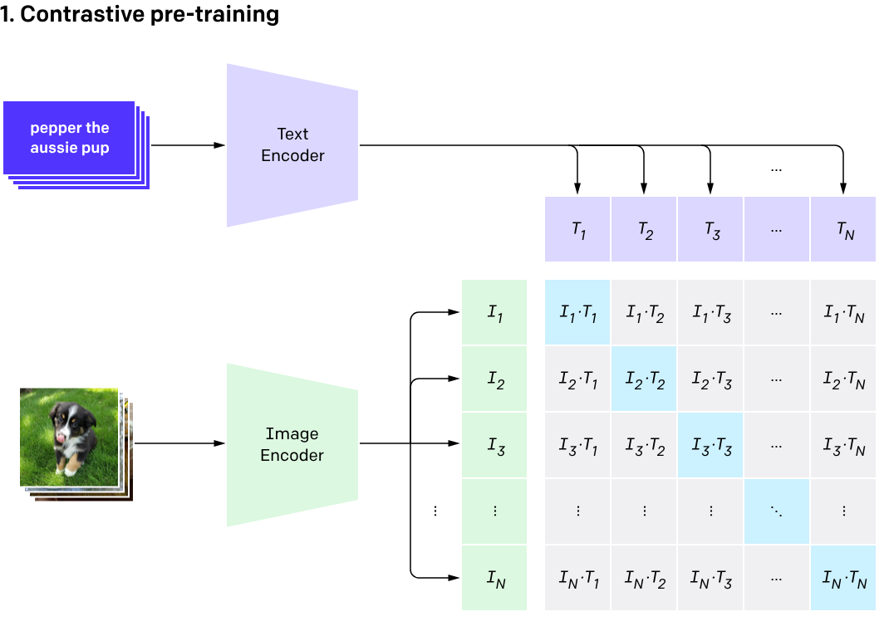
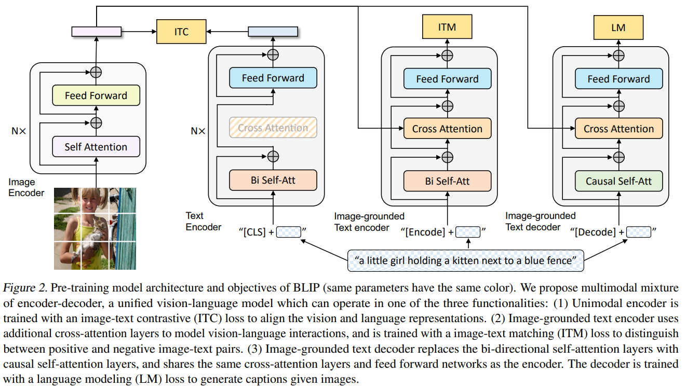
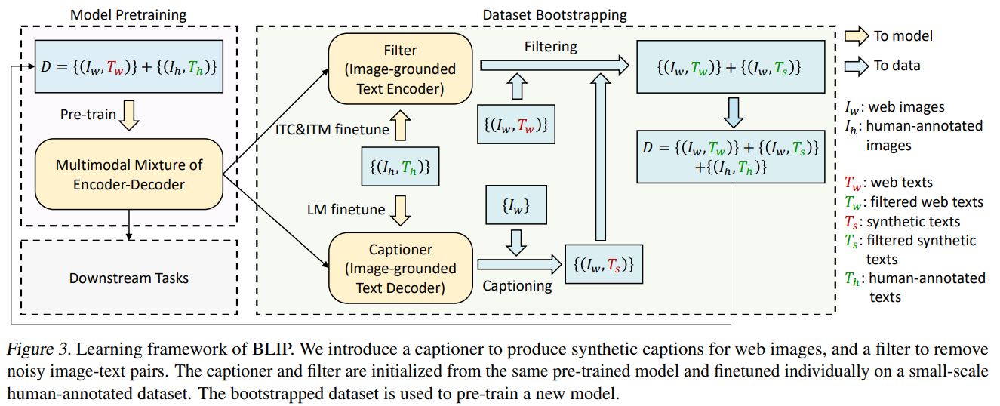
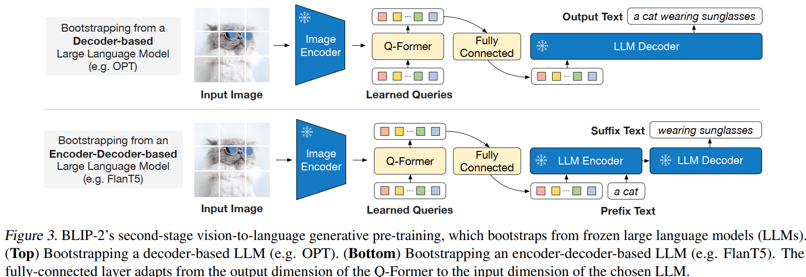
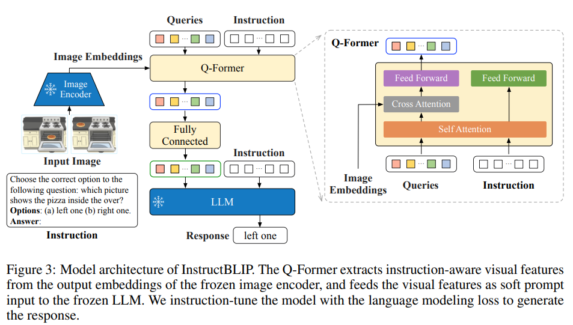
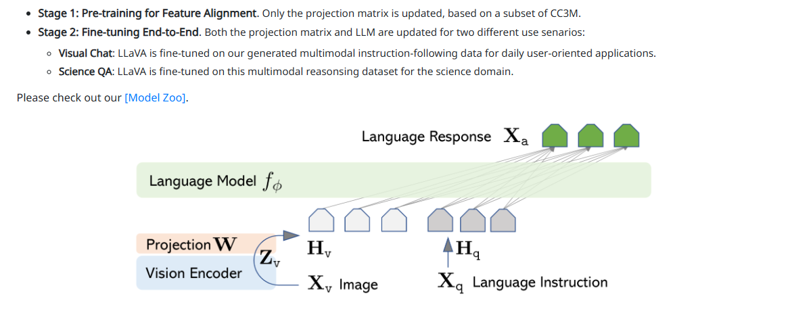
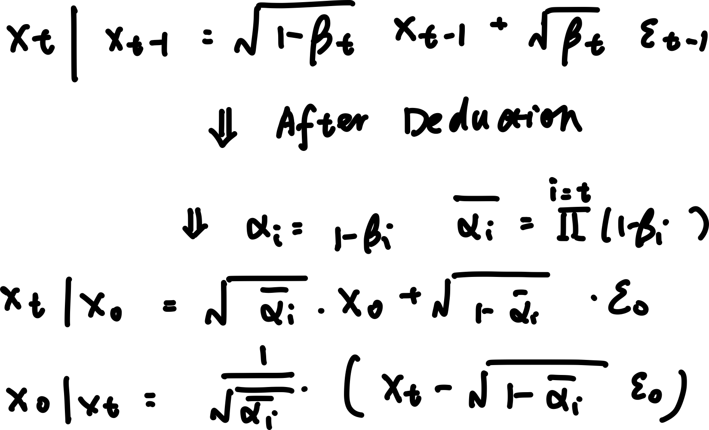
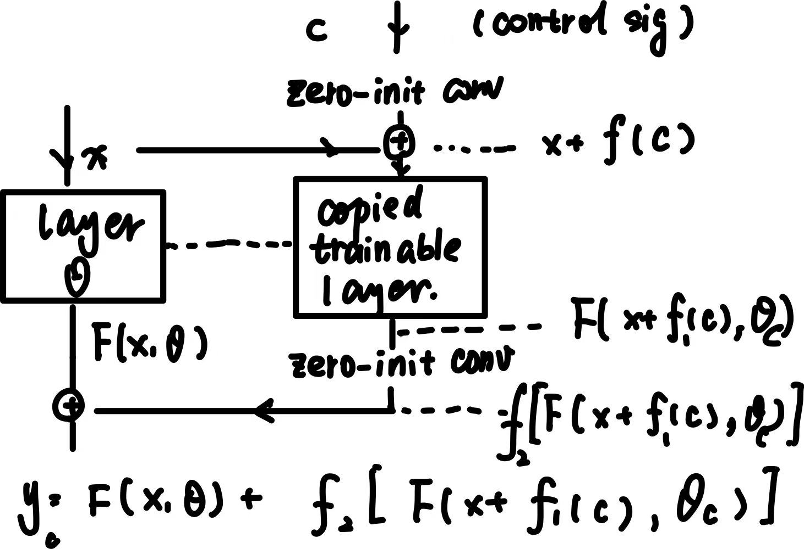

## Subpage

| URL | description | Title |
| --- | --- | --- |
| domain.md | Related knowledge for specific job positions  | Specific domain knowledge for position |
| recSys.md | Simplified for Recommandation sys | Deep Learning Rec Sys |
| infrustructure.md | techniques about large model infratructure: distributed, comparession .etc | LM Infrastructure |
| transformer_lm.md | Detailed description of transformer + techniques for language model | Transformer + Language Model |
| basic.md | Basic knowledge and conceptions about ml and dl | Basic ML + DL |


# Index


[Basic ML + DL](basic.md) 

## **ML**


## **DL**


[Transformer + Language Model](transformer_lm.md) 

## Transformer


- Basic Structure
- Different transformers structures
## Large Model Tricks 


- MoE (Mixture of Expert)
- Fine-tuning 
    - Peft
    - LoRA
    - Adaptor
    - Instruct tuning
    - Prompt tuning

- RAG 
[LM Infrastructure](infrustructure.md) 

[Deep Learning Rec Sys](recSys.md) 

[Specific domain knowledge for position](domain.md) 

## Multi-Modality Model 


### **CLiP **





- Align text with image 
    - The similar text-image pair will be close with each other 
    - Mismatch pair will be away from each other 

- Train 
    - self-supervise: only need right text-image pair 
    - Train image and text encoder ⇒ them will be reflected to same vector space 
    - Trained by contrastive Loss: similiarity between each pair  

- Inference
    - Give text / image ⇒ embedding ⇒ retrieve the topk similar from given images / texts description 
        - Can used for **search engine **


### **Blip**


- VLM 
- Train 
    - Trained elements
        - An image encoder 
        - An image-grounded encoder for text ⇒ better on select / retrieve text for image 
        - An image-grounded decoder for text ⇒ better on caption image 

    - Contrstive Loss (image - text) (ITC)
        - similar to clip 

    - Match loss / classification loss ( image -text match)(ITM)
        - **classify whether it is the right text **
```math
L_{ITM} = -YlogP - (1 - Y)log(1-P)
```


        - Train a **filter for text**
        - Image embedding in **cross attention **

    - language loss 
        - the same as GPT, the probability of next word 
```math
L = -\sum{log(P(\omega_t|\omega_{i<t}))}
```


        - Train a **text generator **

    - Two stage training
        - coarse train: on a low-q dataset: self-supervised ⇒ still use all losses
        - One specific task / dataset: VQA, caption etc. 








### **Blip2**


- Like Blip1 , but 
    - Align with LLM 
        - Add a fully connected layer to align
        - Loss : vision-language

    - Compress two encoders ⇒ use Q-Former instead 
        - One **visual representation learner: **
            - Original: Image-text + Image-grounded -text 
            - Only learn **a small subset of embeddings**

        - One text-decoder: similar to original decoder 





- Train: two stage
    - First stage: coarse: only Q-Former like Blip1 training 
    - Second stage: on specific dataset, both Q-Former and fc layer

### Instruct-BLiP





- Other part is the same with **Blip2 **
- Only add another **intruction tuning **stage: replace the original input text with **instruction style input**
### **LLaVA**


- A multi-modal **reasoning-enabled model**
- Has training parts
    - Clip encoder
    - A projection layer to align text with image
    - LLaMA: used for text generate

- Training: pretrain + **instruction-based training **
    - pretrain: only the **projection layer** is trained ⇒ align the image with text 
        - Large dataset

    - instruction-based
        - The **LLM + projection is trained**
        - dataset: generated by gpt: input instruct → related text → align image with **generated text (a triplet)**
        - Use language model loss: the probability of pridicting the next token



- LLaVA 1.5, LLaVA1.6: 
    - better clip encoder: use ViT(better version)
    - More various dataset

## Diffusion 


- Diffusion vs gan
    - More stable and can learn more general data distribution 
    - More expansive

### Basic


**DDPM**

- Forward: Add noises step by step to the input image
- Backward: pridict noise **reversely by sampling**. It is a **stocastic estimation**
    - Depend on previous **sampling**** xt **
    - Gaussian noise sampling

- What is noise scheduler:  noise variance 𝛽𝑡 over 𝑇 steps
    - In inference, will add a  **random noise at output**
        - Each time outputs / generated figures are different 
        - Make the process stocastic ⇒ more accurate learn 


- score function: learned the **distribution of data**. It is learned to match the distribution of data 



- DDIM:
    - difference: forward is the same. Backward is **computed instead of sampling and estmated**
        - Only add noise at **certain steps **
        - Not adding any **random variables **during both training and inference so results are always the same 


- How to speed up
    - DDIM
    - Latent Diffusion: compress to a **lower dimension space**
    - Distillation: train a small set
    - More efficient noise scheduler like **cosine noise**

- What is conditioned diffusion, difference between classifer-free classifer-based
    - Add more information
    - classifer-based: **pretrained network ⇒ **gradient for diffusion 
    - classifer-free: **interpolote the result **w/t info

- SDXL vs flux 
    - flux: transformer encoder-based ⇒ More Global 
    - SDXL: partial transformer based ⇒ **attention based**

### ControlNet


- A hard modulate over output: Like add a **modulator in each output feature map**
- Add layers of `1x1 conv` + `copy trained nueral layers` to learn hard mask 
- Trained parameters
    - zero-init conv: init as 0 to  **avoid adding noise at start **
    - copied layer: all layers in **encoder **
        - The encoder block will use **corresponding zeor init conv and added to correspoinding decoder **


- Advantage
    - Precise 
    - Support multiple conditioning  

- Disadvantage 
    - Expensive: make inference slower even after trained 
    - Memory intensive: one - one ⇒ have to store motiply resutls




- IP Adaptor: add image embedding into  **another cross attention module **
    - Will change the feature map output of generation ⇒ a **soft modulate of generation **
    - The generation will have the similar subject / style as input 
