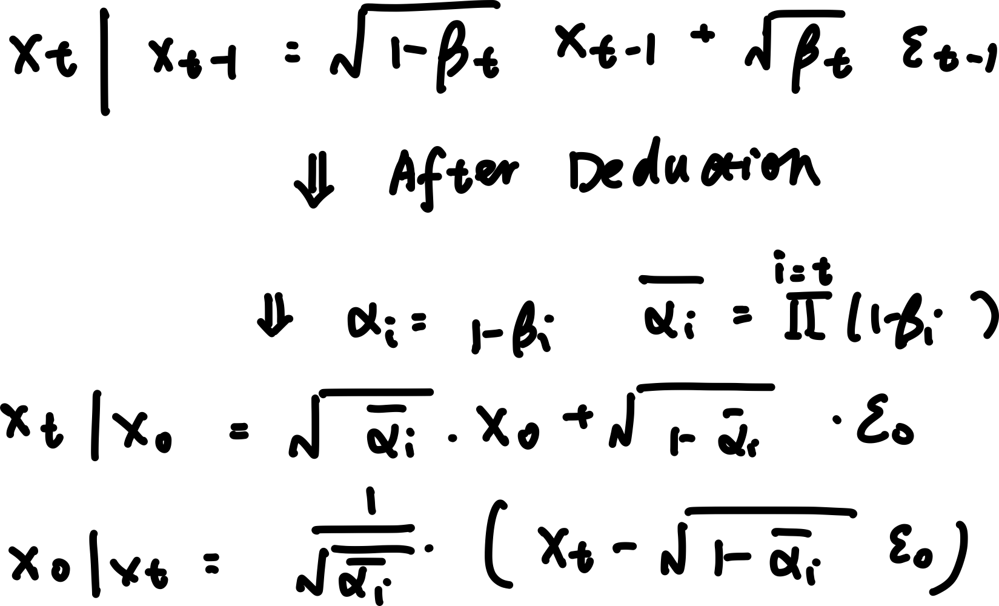
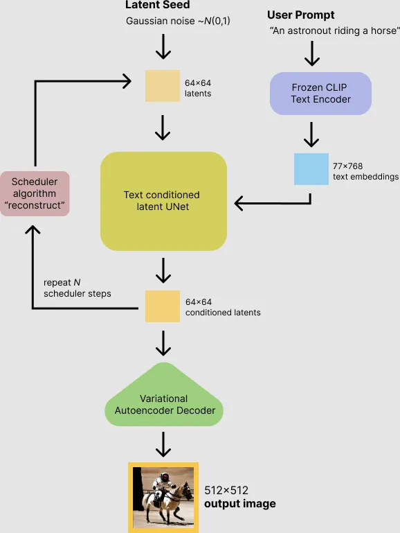
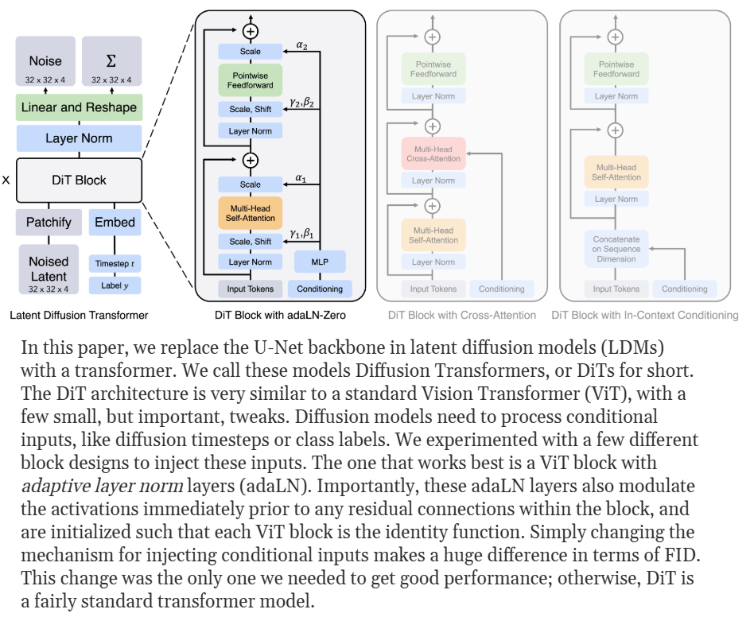
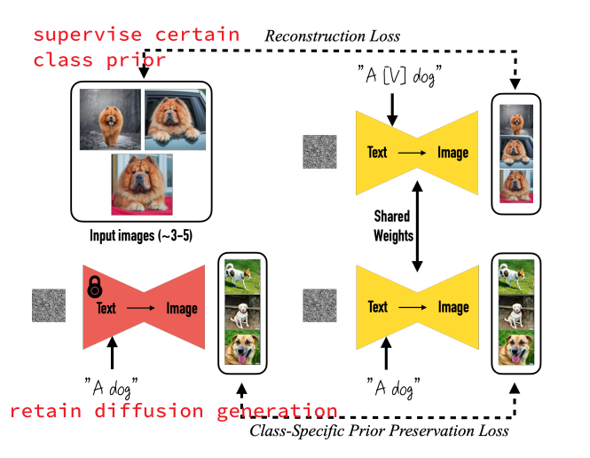
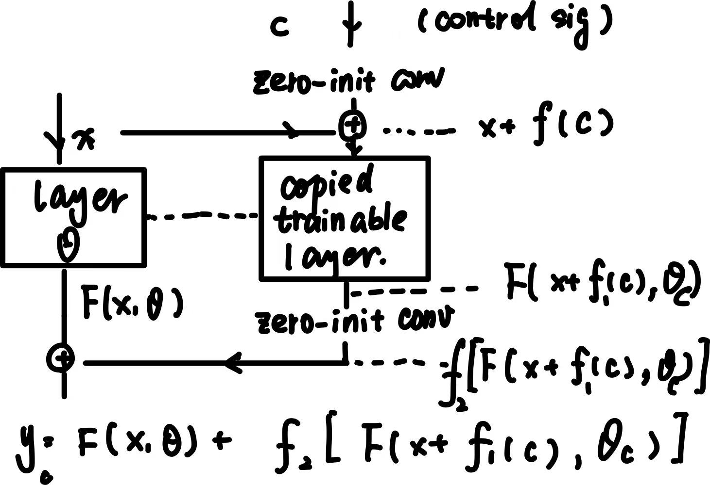
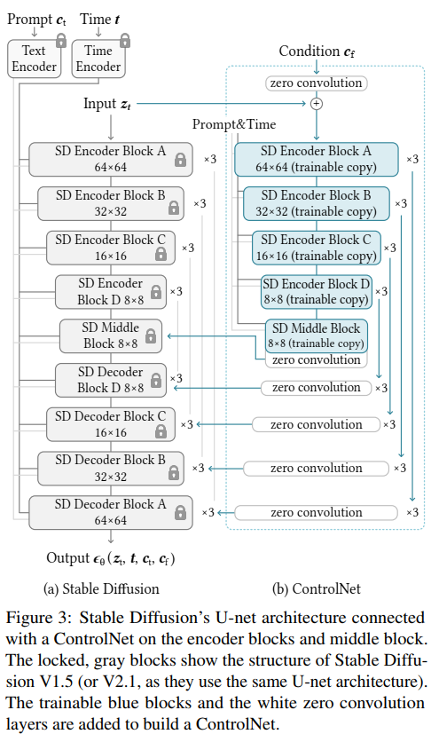

# Diffusion 

- Diffusion vs gan
    - More stable and can learn more general data distribution 
    - More expansive

## Basic Structure

**DDPM**

- Forward: Add noises step by step to the input image
- Backward: pridict noise **reversely by sampling**. It is a **stocastic estimation**
    - Depend on previous **sampling**** xt **
    - Gaussian noise sampling

- What is noise scheduler:  noise variance 𝛽𝑡 over 𝑇 steps
    - In inference, will add a  **random noise at output**
        - Each time outputs / generated figures are different 
        - Make the process stocastic ⇒ more accurate learn 

- score function: learned the **distribution of data**. It is learned to match the distribution of data 

- DDIM:
    - difference: forward is the same. Backward is **computed instead of sampling and estmated**
        - Only add noise at **certain steps **
        - Not adding any **random variables **during both training and inference so results are always the same 

- How to speed up
    - DDIM
    - Latent Diffusion: compress to a **lower dimension space**
    - Distillation: train a small set
    - More efficient noise scheduler like **cosine noise**

- What is conditioned diffusion, difference between classifer-free classifer-based
    - Add more information
    - classifer-based: **pretrained network ⇒ **gradient for diffusion 
    - classifer-free: **interpolote the result **w/t info

- SDXL vs flux 
    - flux: transformer encoder-based ⇒ More Global 
    - SDXL: partial transformer based ⇒ **attention based**

## T2I Generation

### UNet

Reference link: [https://medium.com/@onkarmishra/stable-diffusion-explained-1f101284484d](https://medium.com/@onkarmishra/stable-diffusion-explained-1f101284484d)

Structure

- VAE: into **latent space**, i.e: a smaller or lower dimension space ⇒ input of UNet; decoder: from latent space back to origin;
    - only training need to reflect into latent space. Inference can directly start from noise/hint and denoise(training needs to add noise)

- text embedding: Using CLIP text embedding ( when inference, CLIP will project text to an embedding)
- UNet: add conditioned text to the net ( like another encoder and decoder
    - train: input: encoded image input
    - infer: input: encoded noise / guided mask

### DiT

Link: [DiT](https://www.wpeebles.com/DiT)

### Flow Matching 

## Personalization Generation

### Dream Booth

leverage between fine-tuned learned and original network generation ability

Solution: use two part of loss

- compared with original class prior image
- let the generation after fine-tuned compared with generation before fine-tuned
how to describe the class prior

? target: weaker prior

Use sequence of characters to replace specific descriptive word

⇒ sample from tokenizer

decode to sequence

### IP Adaptor

add image embedding into  **another cross attention module **

## Low-Level Guidance

### ControlNet

- A hard modulate over output: Like add a **modulator in each output feature map**
- Add layers of `1x1 conv` + `copy trained nueral layers` to learn hard mask 
- Trained parameters
    - zero-init conv: init as 0 to  **avoid adding noise at start **
    - copied layer: all layers in **encoder **
        - The encoder block will use **corresponding zeor init conv and added to correspoinding decoder **

- Advantage
    - Precise 
    - Support multiple conditioning  

- Disadvantage 
    - Expensive: make inference slower even after trained 
    - Memory intensive: one - one ⇒ have to store motiply resutls

