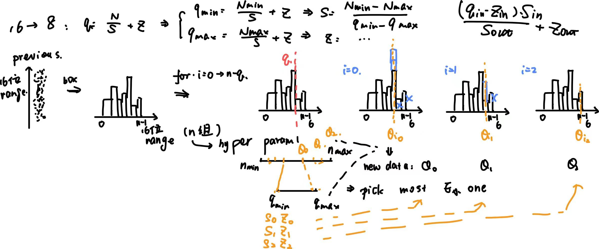

# Distributed Training 


## Data Parallel 


Distribute different **shards of data** in different GPU, 

- Every Gpu has the **full copy** of each model 
- Part of data is held in each GPU 
### Different type of Distribution by PyTorch 


**DP: ****`torch.nn.DataParallel`**** **


- Used for **multiple GPUS on one device**
    - Not support cross-GPU communication

- Everytime’s update need to update on master device and **split **on other device
    - Load on **broadcast the loss and gradient and updated model parameters**
    - Unbalance usage of GPU: The performance of master restricts the training 

- Not recommand 


**PyTorch DDP ****`torch.nn.DistributedDataParallel`**** **


- Have multiple **process ⇒ each process has their own optimizer **
- Broadcast gradient only , but not strictly broadcast, but **all-reduced **
    - <u>**all: **</u>aggregate: different from broadcast, which **sends from one master**, <u>**all-operation**</u> is done by <u>**all nodes**</u> and all will send and recreive results: like **multi-multi **
    - reduce: every nodes average the received shards

- Master: only have a `rank=0` node to log and save checkpoint and start training, but don’t have unbalance / extra computation 
- Each process computes
    - Forward
    - Loss
    - Gradient 
    - Update 

- The gradient **aggeragate, average and boradcast **to all GPUs ⇒ use same gradient confirm the **model is always the same **⇒ called **reduce **(like MapReduce) 
    - Parameter update **independently **
    - Once the gradient of one parameters is ready ⇒ broadcast ⇒ once all GPUs is **aggregate the parameters are updated**
    - When the reduce is computing, the other parameters gradient computation is continueing ⇒ another form of parallism 

**PyTorch FSDP **


- Have shards <u>**optimizer, gradient and model **</u>on every GPUs ⇒ the PyTorch implementation of **ZeRP of Deep Speed **(Explanation and how to do see there) 
- Separate `all-reduced` to `all-gather` and `reduce-scatter` 
    - `all-gather` : all send GPU shards and receive others
    - `reduce-scatter`:  compute the average / sum of the model parameters and **scatter** them to diffent GPU shards


## Pipeline Parallel 


### Simple Pipeline


- One kind of <u>**model parallel**</u>** **which put different “layer” of models on **different GPU**
    - Only **output data **is sent to differnet GPU

- During inference: Data will forward and backward from first layer to last layer, which are all on different GPU ⇒ while finish one data and wait for backward ⇒ process following data


- Problems if only simply use pipeline
    - bubble: may wait **too long time to a**ccess data
        - assume have one data, K GPUs, the idel GPU
```math
bubble \: time=\frac{K - 1}{K}
```


        - Communication time
        - Need to store the **intermediate state for every input **⇒ ealier stage needs to save **more intermediate state **and may be risky 


### **Improvement**


- Micro-batch: have **data batch **inside each GPUs: one time only implement one batch ⇒ After finish this batch, it moves to **next GPU while the next batch on this GPU**
    - Create “a multiple input” so reduce the waiting time 
    - But needs to **trace the batch value even it is sent to next GPU **
        - To follow the **whole-batch **variance and avg for update
        - The frequent **flush will increase idel time**

    - If slice in M micro batch 
```math
bubble \; time = \frac{K - 1}{K + M - 1}
```


- Re-materialization: compute the **intermediate value **instead of store them 
    - Decrease the used memory **very effectively **
    - Only need the **activation of last layer ** of **the same **GPU, so the memory max decrease 

- 1F1B
    - Do one time of forward ⇒ do backward **immediately **
    - Can be done in **any minibatch **from last GPU: because each micro-batch in one GPU has **different data and save their own activation **
        - Once the layer finish forward and receive gradient from layers ⇒ it can backward and **delete the stored activation **
        - Don’t need to wait for the **whole batch **to finish 


- Better schedule of FB and activation storage
    - interleaved: allow mixture of **different batch **to be computed
        - Don’t need to wait finishing current batch, the pipeline is always working
        - Needs **multiple times of ** micro-batch 

    - Buffered weights: save multiple versions of models to allow **overlapping Forward and backward**
    - Flushed: **reset pipeline **at the end of each step and collect all gradients to be more efficient 

### Typical Strategy Comparison


## Tensor Parallel


### Introduction


- Split one tensor to **multiple GPUs **
- Basically work for **linear layer ⇒ **because we are separating **matric multiplication**


- What we need to consider during training
    - forward
    - backward: **is conjugate to forward**
        - if in forward we separate the input, when backward, the operation is **merge**
        - if in forward we add the input, when backward, the opearation is **copy**


- When we are computing some large linear layer / may contain large matrix multiplication ⇒ copy input + weights to different GPU ⇒ compute ⇒ merge 
    - From the second matrix(weight) view:
        - column separation: the** result is column **+ input is the same
        - row separation: the result should add + input is **separate by column**

    - From the first matrix(input) view:
        - separated by column: the weight should separated by row + result is added
        - separated by row ⇒ can not do that 
        - not separated ⇒ the weight can only separted by column and the result is also separated by column 

### 1D tensor Parallel


    - So if we are doing two **consecutive matrix multiplication, **we can separate the two weights by **first column and then row**
        - because the input of second multiplication is the **result of first one ⇒ column separation is overlapping features **


- 1D in **transformer block**
    - two linear layer: column + row: need two `all-reduce` in backward and forward 
    - transformer + linear: attention: one separation + one separation in linear: also two `all-reduce` in backward and forward


### Other Dimensions Parallel 


- 2D: input and weight all separated to `q * q` , broadcast input and collect the needed sub-results for output


- 2.5D: the input is separated to `d * q * q` (2d grid separation), but `d * q` dimension is further **sliced to d layers **
    - Better balance between **communication cost and **

- 3D: The weight matrix is split along input, output, and batch dimensions
    - More balanced and scalable
    - Network load less ⇒ but need more complex communication pattern 


## Mixture Parallel


- Mixture of different parallism types (from ZeRO-DP, TP, PP) 
- Apply one kind on `n` GPUs ⇒ one dimension ; if apply one in `m` clusters and each cluster use another with `n` GPUs in `m * n` two dimensions 
- 2D: e.g: DP + PP (4 needed)
    - Data RankL: two ranks of DP
    - GPU 0-2, GPU1-3: two ranks of PP


- 3D: e.g: ZeRO -1 + PP + TP (8 needed)
    - Always only separate **optimizer: **because it will add load to pp with `reduce-scatter` of gradient after ZeRO2


- Examples for popular structures
    - GPT: DP + PP + TP(1D)
        - DP enables more data, but the model size is a problem 
        - PP and TP allows model to run on multiple GPUs, with separate inference on separated layers and tensors

    - PaLM: DP + TP(2.5D) + shared FFN 
        - DP: more data 
        - TP: 2.5D make it more efficiently while keep it separate the layers
        - Shared FFN: memory efficient 

    - Megatron-LM: PP + TP1D)
    -  

## Sequence Parallel (always for LM with long input)


## MoE Parallel


## DeepSpeed


### ZeRO


**model shards: **only one shard of model + optimizer + gradient is stored in GPU 

- Stage1: shard for optimizer: in each GPU, `1/N` optimizer parameters updated ⇒ the gradients are **all-reduced **to other shards to let they update **corresponding **optimizer
- Stage2: shard for **optimizer + gradient: **in each GPU `1/N` optimzer + gradient computed ⇒ **reduced-scatter **to update the **correspoinding **model 
- Stage3: shard for **optimizer + gradient + weight: one layer of model, optimizer, gradient is **saved in each GPU ⇒ `all-gather` + `reduce-scatter` instead of `all-reduced` 
    - Foreard and backward is done **layer by layer **
    - Each time: 
        - `all-gather` to fetch one layer ⇒ 
        - forward / backward + compute **gradient ⇒ ****`reduce-scatter`**** gradient**
        - (After get all gradients) Update parameters(model + gradient + optimizer) locally with gradient


## Summarize 


What to consider and how to train given certain number of GPU? 

**From the point of GPU**

- Memory Size: determine whether a model can be stored 
- Computational power: Faster 
- Bandwidth: communication and data access 
- Optimization and compatibility: Whether all optimization provided by framework can work 
**From the method to accelerate GPU**

- Distributed Training 
    - Data: 
    - Model
        - Tensor
            - Save more memory, especially beneficial in **scable setting**
            - But increase **communication load **⇒ (NVLINK)

        - Pipeline

    - FSDP / ZeRO3
        - Good when no NVLink and not so scable
        - Also huge load on **communication because of all-to-all communication**


- Mix Precision 
- Model compression 
**Considering all factors, how to choose a good strategy for parallsim**

- Have enough GPUs and Nvlink: **3D **
    - First tensor: within node
    - Then pipeline: across nodes
    - Last DP: across replicas of these model 

- Not so many GPUs: ZeRO 3
- Not so quick: DP + PP + ZeRO1 
- Have one device with multiple GPUs 
    - GPU can store model: DDP / ZeRO2 
    - GPU can not: 
        - if nvlink: TP / PP / ZeRO / TP + PP
        - if not : PP > TP / ZeRO


- Have multiple devices and GPUs
    - have nvlink: ZeRO / 3D 
    - no nvlink: DP + TP + PP+ZeRO1

# Inference Framework 


## Language Model Inference


### How to generate the sentence (Auto-regressive model)


**Problem setting**

- input: sentence
- output: generate the **whole sentence **
- how it works: pridict the next tokens → until “end of sentence” met or maximum tokens met 
**Model: Transformer decoder **

- casual attention + FFN 
- Need to **select the next token from dictionary** which have the **largest probability **
- Training: have all tokens → can pridict the next tokens of every entry 
- Inference: Q: the **last token **K, V: all the input


### Parameters of LM 


**How to search for the best seq / predicted token **

- Softmax search
- Beam search
**How to control the parameters for selecting token**

- topk
- top p 
- temperature
## KV cache


**What is cached**

- All K and V of previous tokens
- The saved will used to compute the **influence of processed tokens **on current input 
**How to cache: two stages**

- prefill: parallely compute **K and V of **all given tokens `B, L, E`
- Predict: predict next one ⇒ renew the K and V of this token `B, 1, E` When go to the next loop, the K and V becomes `B, L + 1, E` 


### **Page Attention**


**How it is designed: simulate segment  memory: virtual → physics mem **


**How to use it in cache**


### Batching 


**Normally: LLM batching**

**countinuous batching**


### Speculative 


## Important LLM structure


## RAG: Retrieval-Augmented Generation


## RLHF: Reinforcement Learning with Human Feedback


### Pipeline


### PPO vs DPO


# Model Compression


## Common method 


- Low rank approximation 
- Pruning: post training 
    - Evaluate the importance ⇒ remove certain ratio
    - Finetune 

- Sparse constraint: add **L1 normalization **to loss ⇒ some weights will be 0 ⇒ pruned 
- Quantization 
- Distillation
- Binary Network
- A well designed module 
    - Convolution
        - Holo conv 
        - point-wise: `1x1xCout` no spatial 
        - depth-wise: `HxW` no channel
        - Group conv: `C_in / Group * H * W * C_out`


## Model Quantization


### Theory: math  


```math
q = round(\frac{N}{S}) + Z
```


- what we need to know 
    - `q_max, q_min` : the quantized ⇒ can be computed by **bit **
    - `n_max, n_min` : get through input 

- When quantize from `fp16` to `int 8` 
    - `bf16` , `fp16` : floating point: two parts of 16: exponent(integer part) + floating 
    - `int 8` : only intenger 


- Quantization Loss
    - `round` : if quantized and dequantized ⇒ value changed 
    - Clip: `max_n` is larger than `max_q` 
    - Propagation: error accumulation through operations
    - Sensitive: 
        - data distribution
            - Linear distribute: not sensitive
            - Not evenly, like outliers: sensitive 

        - requirement: tolerate minor distortions ⇒ less sensitive to quantization
        - layer that are sensitive: 
            - Normalize: batch norm / layernorm: sometimes will be fused with other layers
            - Softmax
            - Attention” the softmax part is sensitive 


- Where to quantize 
    - Weight 
    - Activation / output
    - Operation: typically **not quantized**
        - The two inputs may have different scale: quantized is hard 
        - No obvious improvement even quantized 
        - May suffer from quantize error 


- Quantize tensor
    - per tensor: `n_max, n_min` from whole tensor
    - per channel: `n_max, n_min` from each channel and they are quantized **separately **
    - per-group: k colums (for weight) or rows (for activations) ⇒ among tensor and channel

- Saturate vs unsaturate: whether the overflow value **will be clipped**
    - Saturate: frequently used: clip the overflow
    - Unsaturate: not frequently used; keep as it is

- Symmetric vs asymmetric: whether has Z 
    - Symmetric: positive part is symmetric to negative → Z = 0 → easier to implement, faster on hardware, always used for **weight**
        - `min <=0` + `max >=0` so that `0->0` 

    - Asymmetric: follow formula → more precise, always used for **activation**

- Sign vs unsign: to `int8` or `uint8`
    - Sign: to `int8` 
        - minus: if symmetric (-127-127): more accurate but less align with hardware; if not (-128-127): better alidn with hardware

    - unsign: to `unint8`


### Quantize A conv 


- What to quantize 
    - weight: always use **symmmetric quantization**
    - bias: won’t be quantized
    - activation: always use **asymmetric quantization**

- When output need to re-quantize to `int8` ⇒ use **shift and multiplier to **let it more efficiently (don’t understand)
### PTQ 


**Dynamic Quantization **

- Not precomputed any `S` or `Z` 
- Need to requentize back: the input and output are both `fp32`
- Only usable for `Linear` and `RNN` ?Conv
**Statistic Quantization: Caliberation **

- Precompute **all ****`S`**** and ****`N`**** for both weight and activation**
- Input: dataset to recaliberation ⇒ during inference, all parameters try to be `int8` 
- Saved: the **pre-computed quantization value **
- During inference: Use the stored parameters to quantize
    - No dequantize back to `fp32`
    - If after some operations the result is not `INT8` ⇒ need to **requantize back to ****`int8`**

- Threshold search: try to find a quantization way to make KL divergence / L2 distance / … any distance min
    - KLDivergence
    - MinMax



### QAT 


- **Retrain t**o fit the quantized parameters
- Training
    - Keep the parameters as `fp32` to keep **bp accurate**
    - Insert `FQN` to simulate the quantized loss
        - FQN: quantize linear + dequantize linear: the loss of quantization
        - After training, the **scale and zero ** will be saved ⇒ during inference the parameters will be directly quantized

    - Per layer insert two FQNs
        - after weight: estimate weight quantization influence 
        - after output (x * W): assume all the output would be **quantized to ****`int8`**** **
        - Input is not quantized (assume all input is already `int8` ) 


- Influence: like statistic PTQ


### Mixed Precision


**DeepSpeed**

### Quantization in LLM


**AWQ: activation weight quantization**

- Only quantize weights that **are important to activation **
- One kind of PTQ with **selectively quantization **
- Importance: sensitive of **activation-weight pertubation**
    - Use a second order Hessian metrics: when weight change, how will activation change
        - If change a lot: weight in full precision
        - Not change a lot : quantized **aggressively **e.g: quantize to `int4`


**Generalized PTQ (GPTQ)**

- Min second-order errors
    - impact of **quantization on activations**
    - Need to messure activation level impact
    - both **weight and inputs are **try to quantize to make the second order errors min.
        - weight: all quantized; but the scale is selected to optimize error
            - quantize the column **recuresively: **quantize one column ⇒ adjust others to make it optimized

        - input: selective (**channel) ** quantize to optimize error 


**SpQR**

- More **aggressively compress**
    - to `Int4`
    - More sparse parameters

- How to achieve: separate the model into **quantized normal parameters + full-precision sparse / abnormal parameters **
    - First decompoose it into a **lower rank W ⇒ make it compressed + capture main**
    - For the remaining part, will devide it into 
        - Large residuals sparse ⇒ don’t quantize + store outlier
        - Other: quantize to `Int4` 

```math
W = W_{lower \ rank} + W_{quant} + W_{sparse}
```


**SmoothQuant**

- Solved problems: hard to quantize **activation **because their value is **too unstable**
    - weight is easy to quantize: less outliers 
    - activations always contain a larger range and lots of **important **outliers

- how it works: move **noise from activations **to weight
    - WS^{-1}: new weight: it include some noise from activation x
    - Sx: new activation **prescaled /** **smoothed by S**
    - S a learned / computed **per channel scaling matrix to smooth x**
```math
Wx = (W\cdot S^{-1}) \times (Sx)
```


## Model Distillation 


### Structure


- Use a large teacher model to **better train a smaller student model **
    - To reduce inference cost 
    - To transfer to other **generalized**

- Teacher model: original 
- Student model
    - New designed
    - Have less parameters:
        - Less layers / blocks 
        - Less parameters in each layer 
        - Simpler structure


- Train
    - dataset
        - original 
        - results / features / intermediate **generated by teacher model**

    - type: depend on what helps student learn
    - loss: depend on the original model type / reference data

### Distillation Type and Loss


Determine by what reference is used + what is the type of original model 

- Logits supervision
    - Use the **label and probability **to let student have similar probability 
    - The used label is **soft label **⇒ one-hot hard label gives little information + make training harder 
    - Use `softmax` and `temperature` to **soften the label**
    - Also use `cross entropy` to learn similar prob + `KL divergence` to learn similar distribution
```math
Temperature \; softmax = p_i = \frac{exp(z_i / \tau)}{\sum_j exp(z_j / \tau)} \\ KL(P_T || P_S) = \sum_i P_T(i)log (\frac{P-T(i)}{P_S(i)}) \\ L = (1 - \alpha) \cdot CE + \alpha \cdot \tau^2 \cdot KL
```


    - Most common: because most task pridict the labels

- Feature / Attention based
    - Used for layer-wise important / attention score important cases
    - Use `MSE loss` to make the two similar
    - Sometimes the layer / attention head doesn’t the same 
        - interpolate the student 
        - Specifically try to align 
        - Project teacher to student 


- Task based
- Cross-modality based
    - Used for **CLiP and similar**
    - Used for **multi-modality model: **just like how these models are trained ⇒ need to make sure the learned embeddings **are closer to the right one**
        - right one means: the original right pair
        - the same teacher embeddings
        - away from the wrong embeddings

    - Use `contrastive loss` with teacher model 
```math
L_{contrastive} = \frac{exp(sim(h_s, h_t) / \tau)}{\sum_{j}exp(sim(h_s, h_j) / \tau)}
```


- self distillation 


