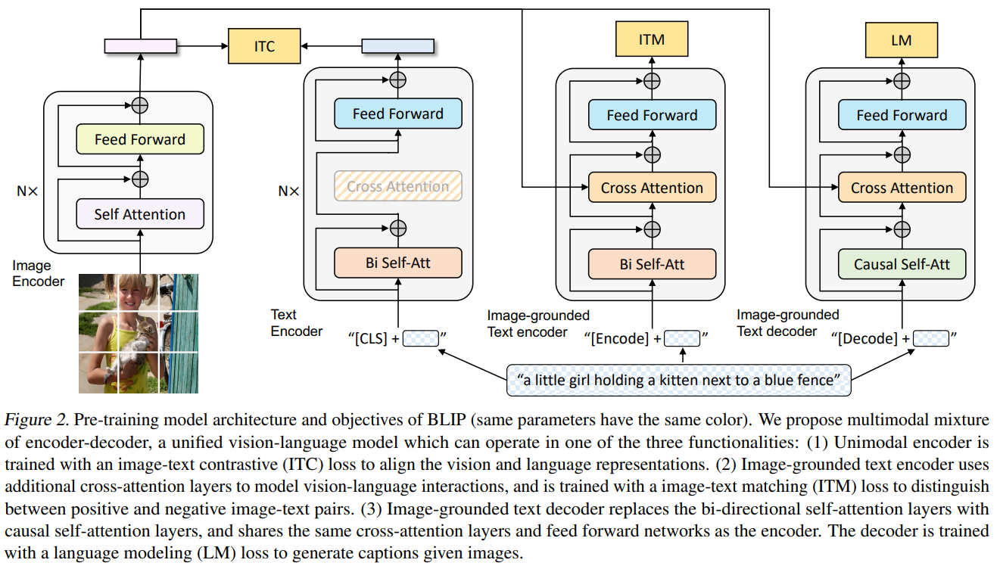
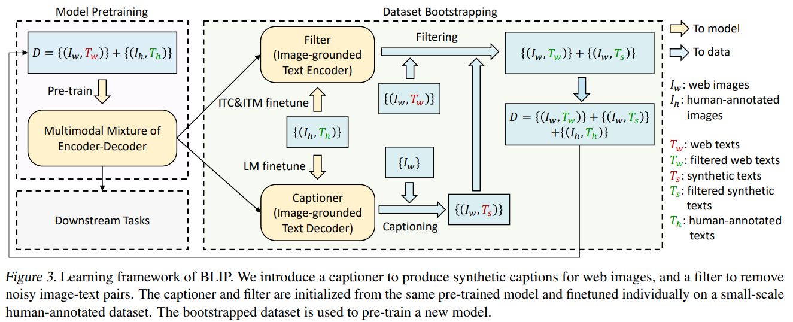
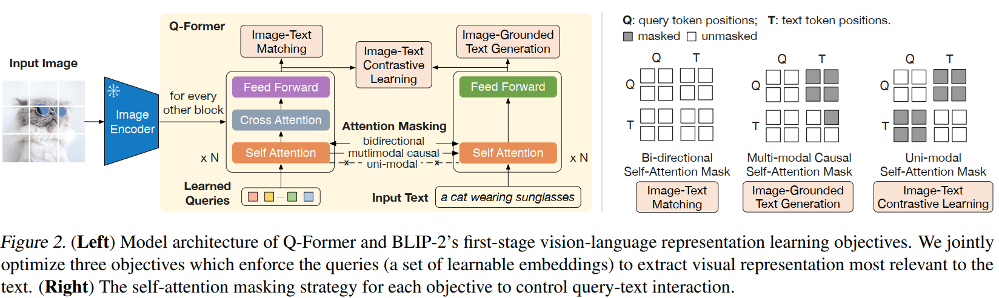
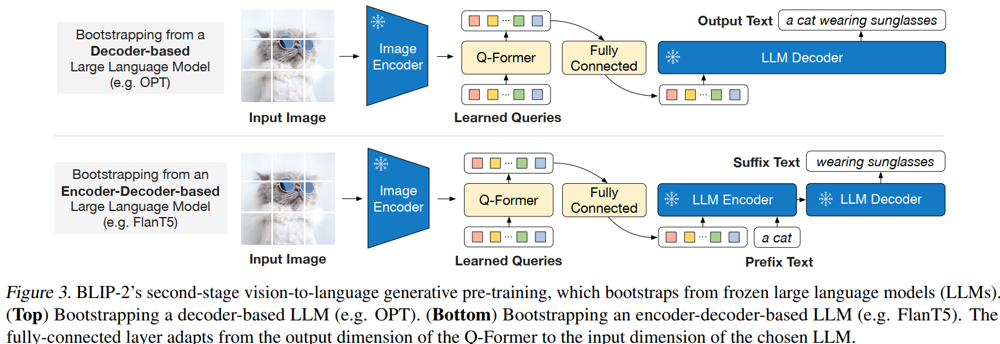
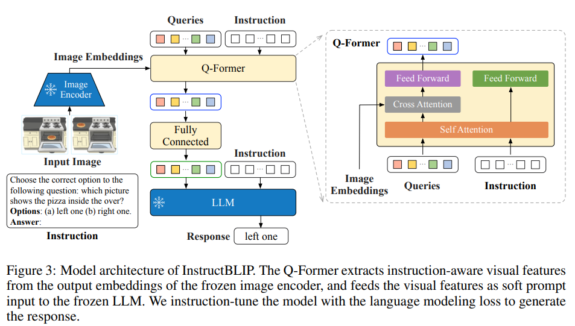
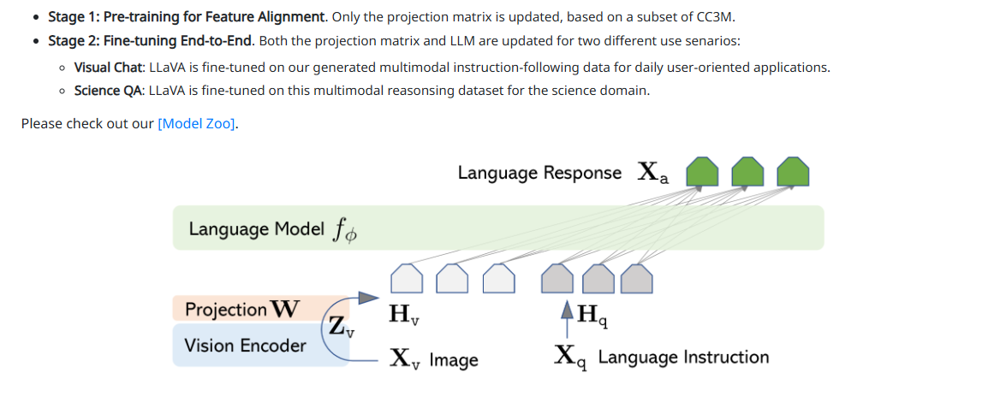

## Multi-Modality Model 


### **CLiP **


- Align text with image 
    - The similar text-image pair will be close with each other 
    - Mismatch pair will be away from each other 

- Train 
    - self-supervise: only need right text-image pair 
    - Train image and text encoder ⇒ them will be reflected to same vector space 
    - Trained by contrastive Loss: similiarity between each pair  

- Inference
    - Give text / image ⇒ embedding ⇒ retrieve the topk similar from given images / texts description 
        - Can used for **search engine **


### **Blip**


- VLM 
- Train 
    - Trained elements
        - An image encoder 
        - An image-grounded encoder for text ⇒ better on select / retrieve text for image 
        - An image-grounded decoder for text ⇒ better on caption image 

    - Contrstive Loss (image - text) (ITC)
        - similar to clip 

    - Match loss / classification loss ( image -text match)(ITM)
        - **classify whether it is the right text **
```math
L_{ITM} = -YlogP - (1 - Y)log(1-P)
```


        - Train a **filter for text**
        - Image embedding in **cross attention **

    - language loss 
        - the same as GPT, the probability of next word 
```math
L = -\sum{log(P(\omega_t|\omega_{i<t}))}
```


        - Train a **text generator **

    - Two stage training
        - coarse train: on a low-q dataset: self-supervised ⇒ still use all losses
        - One specific task / dataset: VQA, caption etc. 








### **Blip2**


- Like Blip1 , but 
    - Align with LLM 
        - Add a fully connected layer to align
        - Loss : vision-language

    - Compress two encoders ⇒ use Q-Former instead 
        - One **visual representation learner: **
            - Original: Image-text + Image-grounded -text 
            - Only learn **a small subset of embeddings**

        - One text-decoder: similar to original decoder 








- Train: two stage
    - First stage: coarse: only Q-Former like Blip1 training 
    - Second stage: on specific dataset, both Q-Former and fc layer

### Instruct-BLiP





- Other part is the same with **Blip2 **
- Only add another **intruction tuning **stage: replace the original input text with **instruction style input**
### **LLaVA**


- A multi-modal **reasoning-enabled model**
- Has training parts
    - Clip encoder
    - A projection layer to align text with image
    - LLaMA: used for text generate

- Training: pretrain + **instruction-based training **
    - pretrain: only the **projection layer** is trained ⇒ align the image with text 
        - Large dataset

    - instruction-based
        - The **LLM + projection is trained**
        - dataset: generated by gpt: input instruct → related text → align image with **generated text (a triplet)**
        - Use language model loss: the probability of pridicting the next token



- LLaVA 1.5, LLaVA1.6: 
    - better clip encoder: use ViT(better version)
    - More various dataset
