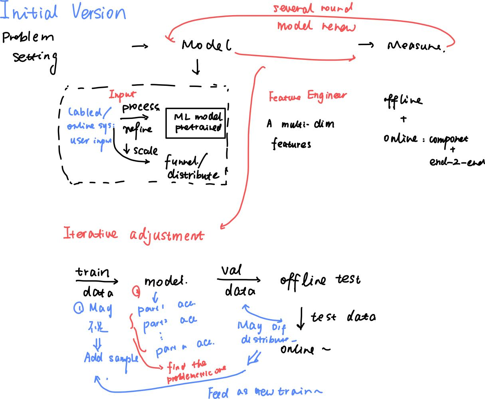
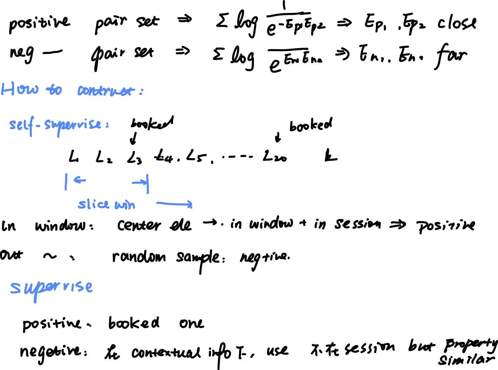

## System design 


### Intro: what, how, element, step?


1. What is ML sys, typical ML sys and class
1. What part does a ML sys have
    1. Data
    2. Model 
    3. Released online system

1. What we need to consider when design a ML sys
    1. Requirement:  ⇒ model a math / ml problems
        1. target: from perspective of business
        2. functionalities: what features and functions?
        3. scale: user numbers? processed volumes? 
        4. Constraints
        5. data: dataset? how many? labeled or not?
        6. performance: fast ? real-time? acc?
        7. bias?

    2. how to design
        1. translate the business objective into a well-defined **ML problems**
        2. **input and output**
        3. **right ML category**
            1. supervise or unsupervised? which model? 
            2. Start from a simple ML model ⇒ complex ⇒ **ensemble **
            3. Whether it can continuely learning and refresh?


    3. How to measure : **Evaluation matrices**
        1. Offline: simulate
            1. Ml model evaluation matrices

        2. online: in **productive env ⇒ **<u>**subjective **</u>**business matrices**
            1. compnent: the design itself
            2. end-to-end: when plug in


1. Typical steps to design and importance, target of each steps
**Load consideration**

**Factor**

- Performance: How the **measurements **
- Capacity: how many **user done at the same time**
Practical solution: **Funnel based + Distributed system**

what we need: a slow dl model + many user ⇒ affordable and fast

**How to evaluate the model used in these process**


- Training: Time taken to train 
- Evaluate: One time evaluation 
- Sample: How much data needed and time taken to **collect data **


**Data collections**

- online data collection: get training data from** the user’s interaction with this system**
    - e.g: rule-based / recommandation

- ofline: labelers: expansive so do it for **hard to solve and data hungry areas**
    - May done during debugging: iteratively fixed the weak point

- Data catogory
    - Raw: like image /  audio /  text
        - Lot of features but hard to deal with traditional model

    - Structured ⇒ less features 
        - Labeled data
        - Processed data 
        - key-value pairs collected


- Train validation and test 
    - Common split:
        - K-fold
        - Fixed partion 

    - hyperparatemer tuning: in validation
    - AB test

- When dealing with real-world data
    - Data avability and size ⇒ model 
    - Data storage ⇒ frequent use
    - Variety: more features better ⇒ more dimensions: consider train a model that can **forecast, **which means** test on different time interval**
    - Needed quantity: balance between quantity vs performance 
    - Filter: 
    - Privacy
    - Remove bias: we can not assume that users will make unbiased choice ⇒ it will make the model be **biased ⇒ **
        - When do online collecting: recommand **randomized content**

    - **Update **data and train model in time: **cold start problems ⇒ bootstrapping(自荐)**

**Feature Engineering (data processing)**

- Fix miss data
    - delete: delete a feature or delete a point
    - imputation: use avg / defaults to fill 

- Scaling:
    - normalization: different ranges of data will be **outliers and hard to deal with**
        - No **scale dominance** ⇒ some scale sensitive method like knn, svm will rely on distances
        - faster convergence 

    - standardization: to `N(0, 1)` 
        - For methods that assume the distribution as <u>**Gaussian**</u>
        - No outliers
        - For data need <u>**regularization**</u>**, **

    - Log: **compress the *****long-tailed data*** to more symmetrical
        - Like skew
        - Reduce too large magnitude 


- Bucketing: 类似画直方图
    - Quantization: some model only accept **discrete input **
        - Naive Bayes, DT

    - Simplify: less interval and representation
    - Distribution for statistics

- Encoding
**Embeddings**

- Why we need embeddings: 
    - lower dimensions and more contract feature spaces 
    - reflect different elements to the same space ⇒ easier to find <u>**similarity**</u>

- General embeddings: use **pre-trained embeddings**
    - Always use self-supervised learning
    - Text ⇒ dense embedding


    - Word2Vec: based on Baysian and Markov
    - Skipgram: one ⇒ surround
    - Context-based text: 
        - BERT: encoder based transformer
        - Embeddings for LM: bi-direction LSTM (ELMo)

    - Vision
        - Encoder-decoder: supervised by result of decoder ⇒ train the **encoder **
        - VGG features


- Particular embeddings: Collect particular data and serve for **specific task **
    - <u>**Data ⇒ Features / embeddings**</u>
    - Feature
        - Longer time than general 
        - Enough data for this representation

    - Input ⇒ different embeddings ⇒ Extracted **feature vectors to **input of the NN 

- Network/Relationship-based embedding
    - Embeddings ⇒ Embeddings (relationship) ⇒ same space

**Training**

- Dataset construction
    - sampling: if have **unbalanced class ⇒ ** upsample / dow sample

Transfer Learning

- Having a pre-trained model and added dataset ⇒ train a** “new model” **
- How to train
    - fine-tune 
        - Last layer 
        - Last fewer (pick some to train) : if share some related and limited data
        - Fine-tune all

    - Add more layers after **output layer**
        - Use the output layer as a **Feature**


Distributed learning


**Online Evaluation for performance and model experimental design**

**AB test **

- Done to test whether an experimental version / variation is **statistically worth to launch **
Step and what is done


**Back testing**

- Do A/B and B/A both 
    - To test the improvement of A ⇒ B is right: if A ⇒ B ≠ B ⇒ A: maybe the improvement is influenced by other factors 
    - To test long-term effect: long time after whether B ⇒ A is increase?





### Common ML system 


**Rank system**


ML method: represent learning / multi-modality learning / can be self-supervised learning 

- Target: learn **similarity **between different categories 
- Data: pairs of data in / not **same groups**
    - Image data
        - Self augment: like rotate or other methods
        - user collected: collect same kind of data
        - labeled

    - Text data
        - preprocess
            - text normalization: in the similar formate, like 语气词, 大小写, 拼写等等
            - text tokenization
            - tokenization to ID: diction table / hash for it 


    - video
        - decode video ⇒ sample frames ⇒ resize ⇒ same as image 


- Structure: a feature extractor CNN / ViT both ok / pretrained model
- Train: **contractive learning **
    - Similar images embeddings are as close as each other
    - contractive loss: same for different modalities
        - embeddings ⇒ similarities ⇒ loss


- Typical pre-trained model
    - Clip: text-images
    - ViT: image-image
    - SimCLR: Vision only, image-image self supervised
    - Audio CLIP: audio ⇒ image 
    - BLip: VQA, image ⇒ text 
    - X-CLIP: video-text 

- Other models
    - Text
        - Statitic model
            - Bag of Word(BoW): 统计all words freq in all sentences
                - no semantic and contextual 
                - sparse vector


            - **TF-IDF: BoW + normalization**
                - normalize the BoW mat based on **freq of words **⇒ less weight on frequent word
                - cons: need to update normalize after each word adding


        - ML based method
            - embedding look up: a look up table stores **embeddings layers of each id **
            - word2vec: describe before
            - tranformer based: IDs ⇒ embeddings to every word
                - DistilmBERT: Bert for different languages


    - Video
        - video level: 3d conv / transformer ⇒ process whole video 
        - frame level: process single frames ⇒ aggregation
            - simple
            - but ignore temporary relationship between each frames


- Get result: **nearest neighbour**
    - Exact nn: linear search ⇒ compute distance between **all input stream** ⇒ get k 
        - Too slow for large sys

    - Approximate NN: `O(NlogN)`
        - tree based: split node by **rules **
        - Locality sensitive hash(LSH): classify it into different **buckets **
        - cluster based: build cluster like k0 means 


**Serving**

- **image 2 image** loose search


- text 2 video exact search
    - video have multiple embeddings dimensions (text + video)


- index: high performance search + fast **update of new data**
**Detection System**


- NMS: non-maximum suppression
    - Alway used in detection sys 
    - Remove repeated bounding box / detection
    - Input: confidence + coordinate of each box
        - Find max box ⇒ compute IoU with other box 
            - if IoU too large ⇒ overlap ⇒ remove

        - Go to next max box 


### Common Evaluation Methods


**Offline matrices**

- MRR: mean reciprocal(互惠的) rank
```math
MRR = \frac{1}{m}\sum_{i}\frac{1}{rank_i}
```


    - def: ranks **first relevent item **in ranked list produced by model
    - pros: easier to produce
    - cons: 
        - only the ***first ***one is noticed ⇒ can not have multiple return
        - not measure precision and acc 


- Recall (漏报)
    - how many relevant detected / all relevant (right / all-right)
```math
Recall = \frac{true=>true(detected\;true)}{all\;true}
```


    - cons:
        - no **quality of return** ⇒ will be affected by **too many right examples**
        - not good for no positive


- Precision (真的有害占有的检测有害比例)
    - how many relevant / in k output
```math
prec =\frac{real\;true}{all\;detected\;true}
```


    - cons: not accurate ⇒ can not have **score for different relevance**
    - not good for no positive

- mAP
    - average precision for each relevant items ⇒ average items precision for each ranks
```math
mAP=\frac{\sum_i prec\;at\;i^{th}}{all}
```


    - Can evaluate **quality**
    - **Binaray evaluation **

- FPR (假阳 /  错报: 误报: 无关判为有关/无害判为有害 在所有无害里面的比例)
    - how many false is detected as true
```math
FPR=\frac{false => true}{all \; false}
```


    - for no false not good

- AUC / ROC
    - Trade off between  Precision vs recall TPR(recall) vs FPR


- nDCG
    - def: **quality of ranking **compared to ideal one 
        - DCG: sum of relevance score of **each item at each location**
```math
\sum\frac{rel_i}{log_2 (i + 1)}
```


            - relevance score is given by gt

        - nDCG: DCG / ideal DCG

    - pros: evaluate the **quality of each item**
    - cons: relevance score may not accessible 


- IOU: intersection over union: for object detection
    - evaluation determined by threshold 
    - Further use map, rec, precision


**Used offline matrices based on ML system**

- Search
    - Exact match: MRR: only the first one is needed
    - Loose match: nDCG: can measure the search quality and can evaluate **several return and items **

**Online matrices**

- CTR: click through rate 
    - clicked images / recommanded images

- Average time on suggested searched result 
- Prevalence: like acc or ratio like this: how many are not detected
- User report
- User impression 
**Recommandation system, search engine, info retrieval **

- Use nDCG
### **Content Detection**


- Problem setting:
    - input: multiple modalities, including
        - image
        - video
        - text
        - user hash tag

    - output: **multi-kinds classification**

- Key problem: how to deal with **multi-modalities and their relationship **+ **which** **multiple classifier**
    - typically: separately handled + later fusion ⇒ not suitable
        - ignore relationship between different modalities ⇒ like if the content is bad only with **combined text and video **

    - For this one: early fusion 
        - fuse the  embeddings **before input to content detection system**
        - embeddings of each modalities ⇒ merge 


    - classifier: loss: binary search loss like** cross entropy** typically uesd:
        - simple binary x
        - binary + multiple output layers + separate output binary tree ⇒ too much load on storing 
        - mutl-class: embeddings ⇒ model ⇒ multiple classes
        - multi-task: same embeddings ⇒ different classifier heads ⇒ different output


- Data
    - Post: text + image + video … ⇒ like before
    - user:
        - Simple features proposed by multiple **hash tages**
            - id, interations, likes … all just data itself ⇒ **normalized to feature vectors**


    - comment:
        - Also text ⇒ text preproces ⇒ aggeraagte all comments ⇒ one feature embeddings


- Evaluation: AuC + ROC
- Serving


### **Recommandation System**


**Basic knowledge and classification of rs **


**Cold Start**

- Influence CF (collaborative filtering): need interaction between **user and item **
    - User - user: rec similar user’s list
    - item - item: rec similar item which is viewed
    - user - item: large scale 

- Solve:
    - contextual info 
    - Content based major
    - new user:
        - statistic: hash tag
        - social based 

    - new item
        - self boost: 买推广
        - hash tag: category … 

    - new system:
        - use trained model 
        - 人工标注
        - 跨平台


**Embedded based**

Typical Example

- Video rec 
- Image rec 
- List rec 
<u>**video rec**</u>

- Most important: content > metadata / Most features are raw data, not many features to **select(so no need to use tree or some structure like this to determine which features are importatn)**
- Strategy: both **content-based and Collaborative filtering based**
    - Use cf to **filter **metadata and not in history / user taste in first stage
    - use content-based to **rank **in 2nd stage

- Data: concatinate features of 
    - user: 
        - interaction history: liked video, search history … 
        - id, preferance, gender, age …

    - video
        - content: expensive
        - other metadata, like text, title, id, duration, … 

    - context:
        - time, date, device …


- Model: two-tower
    - matrix fabricate:traditional way: separate user - video pair into user embeddings and video embeddings ⇒ train model to generate best embeddings
        - interact mat ⇒ user embedding + item embedding ⇒ similarity
        - cons: ignore metadata and hard to update


    - two tower: 
        - different type of data ⇒ nn ⇒ embedding layers ⇒ **ffn or cosine similarity ⇒ relation embeddings**


- Evaluation
    - offline: mAP / diversity
    - online: 
        - CTR ⇒ may cause 标题党
        - completion video ⇒ shorter video
        - watch time
        - feed back 


- Serving
    - two stages:
        - a simple two-tower model: user vs. video **metadata **millions ⇒ thousands
            - video features are **indexed and stored**


        - more complex ( more parameters) : user vs. video **content ⇒ lists of videos**


List Rec

- Why embedding-based: 
    - do not have meta-data ⇒ only data in **short time window **
    - We know we are finding the embeddings of **window’s lists**, and are finding the **nearest embeddings **

- Data preparation 
    - List Interaction: what is “a window”: split by **booked list **


- Model: a shallow nn


    - why a simple nn
        - There are limited data to train
        - No interactions between each elements in a list ⇒ looks like a situation for rnn, but not suitable 
        - Need to learn the embeddings that in one list is similar out of list is not similar

    - Key: how to train the model: self-supervision + surpervised
        - loss: **contractive loss **measure the embeddings **similarity between pairs**
        - self-supervision: **local info**
            - a slice window ⇒ inside is the positive, outside is negetive
            - select positive pair, negetive pair 
            - Make their embeddings close / far 

        - supervised: **global info **
            - add a positive pair: the **clicked item is definitly related**
            - add negetive pair: based on other metadata or contexual info 




- Evaluation
    - offline
        - nDCG: the choosen list should appear as early as possible

    - online
        - CTR
        - **Session book rate**


- Serving 
    - Store all list’s embedding 
    - User input 
        - in index: return
        - not in index: compute 

    - Fintune model:
        - collect list 
        - finetune 
        - renew all index table 


**Other Recommandation system**

Moment recommendation

- System: given recommanded post for users ⇒ **multi task recommandation **⇒ need to recommand based on different interactions 
- Data: interaction data 
    - user: user hash tag + info 
    - interacted post: post content + hashtag + other factors may influence
    - interaction type with post(like share, like …)
    - author of posts

- Model
    - multi-task: a normal nn model + different detection head 
    - inference
        - retrieve candidate posts from user’s connections
        - pridict each probability
        - do a binary judge of whether recommand


- 
**Learn to rank **

example: <u>**event-related**</u>, product-related (may also need list rec), <u>**ads recommandation**</u> 

- Data preparation
    - Basically: **structured data**
        - For raw data, like image and video, use pre-trained model to generate embeddings and **concatenate with others **⇒ not so important 
        - Other structured data: **bucket **or directly normalized and concatenate


- Model: baseline + nn
    - baseline: usually a very simple one
        - why: help determine which features are  more important + evaluate preformance of nn
        - Requirement: 
            - easy to interpret
            - easy to train
            - accept many features

        - example
            - logistic regression
                - only linear separable 
                - interpreable 

            - gradient based tree boost
                - like random forest, many trees determine the results, train one for each time of update
                - intertretable, no normalized needed 
                - can not update + lot of parameters

            - **Factorization Machines**
                - designed for cross features: interactions between features
                    - wixi: weight (linear part)
                    - vivj: embedding. Both item and user i.e: all collected data


    - nn
        - nn
        - DCN: designed for cross features


        - **Deep Factorization Machines (DeepFM)**


- Train
    - which nn to use
        - if the data needs **interaction info from rich interaction + sparse data**: DeepFM / DCN is better because it can learn corelative info
        - if the data is **cold-start / simple: **use nn is enough

    - two stage models: first train simple baseline ⇒ then build a nn **ahead or replace **baseline, while select / emphasize more important features based on **baseline evaluation**

- Evaluation: relevant irrelevant ⇒ **binary classification**
    - mAP
    - CTR
    - revenue 
    - CE(cross entropy)


- Serving
    - cold-start: no continuous learning ⇒ the training dataset is renewed **by batch **


    - quickly update sys ⇒ contineous learning and update training data


**Pridiction Recommandation**

Music list rec

- Based on the **time sequence of history** ⇒ The **order **of clicking may determine the “interst" 
- A Pridiction problem 
**People you may know recommandation**

- Features: need to know the **connection between each input / always need in social network **
- Data need to use
    - Collect
        - node: user: user tag, info ⇒ features that used in corresponding
        - edge: user connections
            - two nodes
            - interactions: different kinds of interactions


    - Feature engineer
        - node: except for user’s data, also add features related to connections, e.g: followers, reactions… ⇒ evaluate whether it is an **active users**
        - interactions: what interactions + interaction time


- Model: GNN
    - pridict the emb of **each nodes **⇒ use similarity to compute the next recommanded lists


- Evaluation
    - offline: a **binary evaluation **
        - RUC-AUC
        - mAP 

    - online: the accepted connections 

- Serving:
    - Range: friends of friends ⇒ less computation 
    - pre-compute: to recommand in time ⇒ compute all rec for all users

# Basic


# System Related / Frame / Tool…


# Feature Processing


## Intro


### Feature & embedding


在已有的、可获得的数据基础上，“ 尽量” 保留有用信息是现 实中构建特征工程的原则

**Always used features**

- User actions
    - 行为 ⇒ 抽取/挑选权重
    - 显性: 直接对商品质量打分
    - 隐形: 态度 / 观看时长等难以量化 / 直接说明 / 用户直接的**交互 **

- User Relationship / interactions
- Tag / Property
    - `multi-hot` 
    - 转化成 `embedding` ⇒ 构建 **知识图谱 ⇒ ****`GNN`**

- Content description
    - 检测特征后输入

- 场景信息 (context)
    - 
