# Transformer


## **Structure **


- Element
    - Input embeddings:
    - Position encodings:
    - Self attention:
    - feed forword layers 
    - layer normalization

### **Attention**


```math
Scores = \frac{(Q \cdot K^T)}{\sqrt{d_k}} \\ Attention = Softmax(Scores) \cdot V \\ Q = XW_Q \; K = XW_K \; V = XW_v
```


- Why better, how to process sequence
- How is it used in vision?
- Why this formula
    - Scaled `d_k` : Prevent too large softmax caused gradient problem 
        - Why `sqrt(d_k)` : assume each vector of `Q` and `K` variance is 1 ⇒ matrix multiplication is `\sum(q_i * k_j)` , do sum for `d_k` times ⇒ the variance becomes `d_k` ⇒ to make the training stable, keep the variance as `1` ⇒ must divide by `sqrt(d_k)`

    - Multihead: The embedding space is been splited to **h channels / heads **⇒ Perform better in bad initialization 
        - Indicate that only part of embedding space contribute to learning 
        - Different head learns different expression from **different sub-space**, the combination of them 
            - Has the chance to learn **one part of expression**
            - Like learning different expressions of reflecting ways 
            - Use lower dimension to prevent **too much computation loads** + part of dimensions are enough to learn one kind of expressions 


- Roles of **QKV**, difference? for **entry i**
    - Q: All of tokens will be used ⇒ how the selected entry is related to **all others / background / Q provided info **
    - K: The selected identifier ⇒ How this connected to the all Q?
    - V: Actually computed input. If it is a normal neuron layer, **V is the only computed. **It is weighted by **Score given by Q and K**
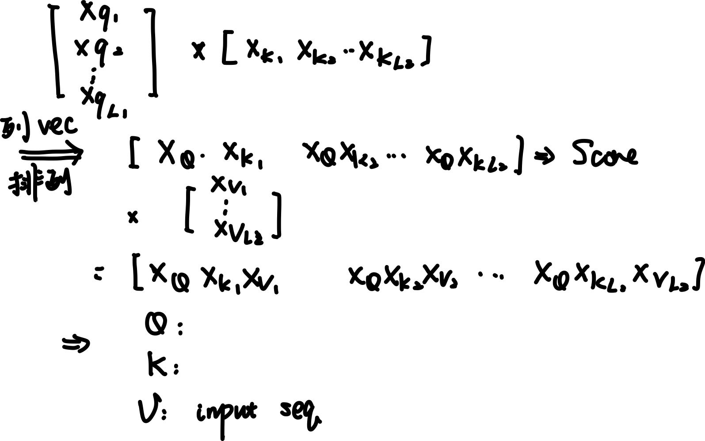


- Self vs cross
    - self: same X , same sequence length
    - cross: same X for **K and V, **different Q; **same embedding space **
        - E.g: sd: K, V: text; Q: image 


- Implementation
### **Other parts**


- Position encoding
    - Add **position info in transformer**
    - unique, continuous, and **position-dependent **representations
    - Need to make **every word have different output**
        - Abslout encoding: Always use sin cos
```math
E_{2i} = sin(\frac{pos}{10000^{2i / D}}) \;\;\; E_{2i + 1} = cos(\frac{pos}{10000^{2i / D}}) \\ i \; refers \; to \;\; i^{th} \; dimension \; of \; total \; embedding \; dimension
```


        - Encode long range and short range differently
        - Relative encoding: only depend on **relative position **
        - T5: adding a trainable **bias **
            - bias is depending on the **bucket relative position**

        - RoPE (rotatory pe): encode **absloute and relative at the same time**


- Feed forward network
    - Manipulate the output to needed formate: like probability 
    - Add Residual model: add back the origin input
        - Based on resnet: easier to train 


- Layer Normalization
    - After adding residual, without normalization, tend to gradient explosion or gradient disappearence 
    - NLP is too unstable for each word to use batch normalization
    - Normalize along each **embedding dimension **⇒ the info of each batch may from  different length of tokens + the info over each tokens should reserved ⇒ only the info of each token sequence is mixed ⇒ i.e: the embedding dimension

- Weight Sharing 
    - Sharing among **transformer blocks: **all blocks in encoder / decoder use the same blocks ⇒ only have one set of parameters 
    - Sometimes: sharing among encoder and decoder ⇒ **same blocks at the same position** have same transformer blocks
```python
Encoder = nn.ModuleList([Transformer() for _ in range(N)])
# shared
SharedTransformer = Transformer()
Encoder = nn.ModuleList([SharedTransformer for _ in range(N)])

# decoder 
Decoder = nn.ModuleList([SharedTransformer for _ in range(N)])
```


- Train: Adam + warm up 
    - The self attention will bring **unbalance lr for QKV ⇒ Need different lr for QKV ⇒ Adam**
    - RLHF: reinforce learning with human feedback
        - Train a reward model: give score for **different quality of generation **
        - Finetune LM by reinforce learning: generate (policy) ⇒ score ⇒ trained based on **reward**


- Implementation of all
### **Modification of MHA (MHA vs MQA vs MGA)**


- MQA: Use only **one group of K and V **in a multi-head attention 
    - Typically used in large-scale model: **LLaMA **
    - Two way to train
        - Directly use MQA from training and directly use 
        - Train multiple MHA ⇒ Add a **projection layer to **merge them + funetune (Only used in research because of cost 


- MGA: use multiple **groups of K and V **in a multi-head attention
    - Not always used in real world 
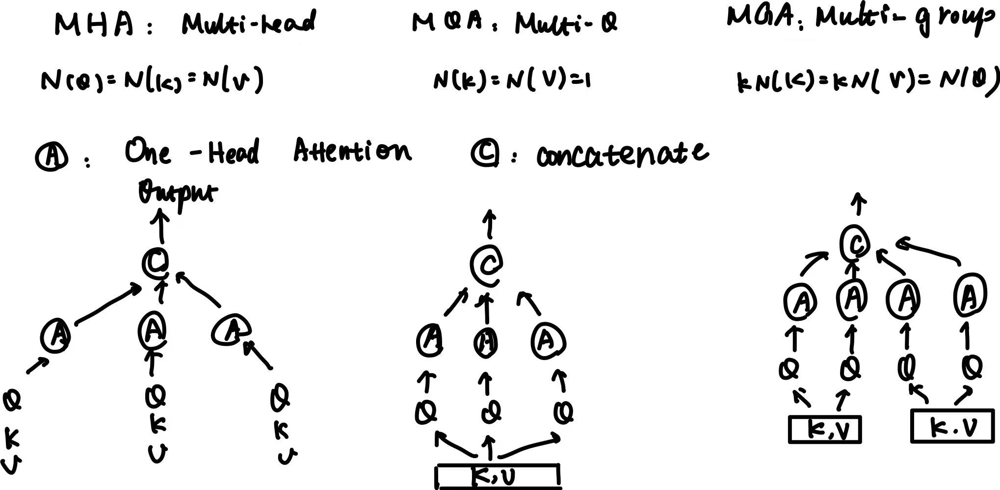


- Flash attention: accelerate implementation by **block loading + compute in SRAM **
    - Compute the `O(N2)` Softmax in SRAM 
    - Load the block from Q and K, V and compute them one by one 
        - Record the `max` and `softmax sum` in one block 
        - Renew the current `row computation` with new value 
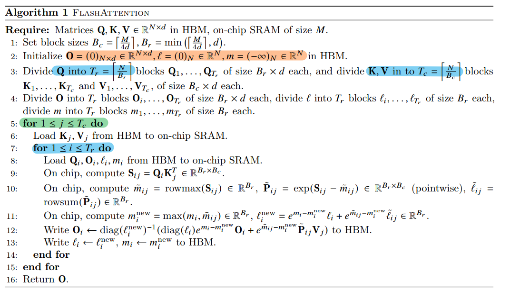


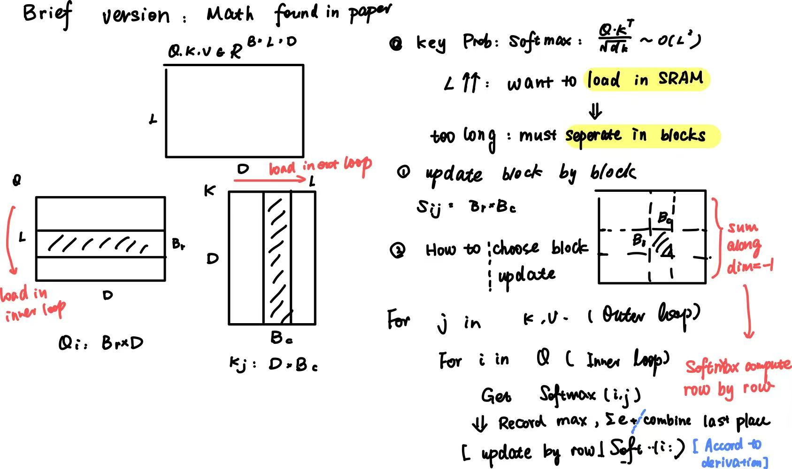


**Comparison with other part**

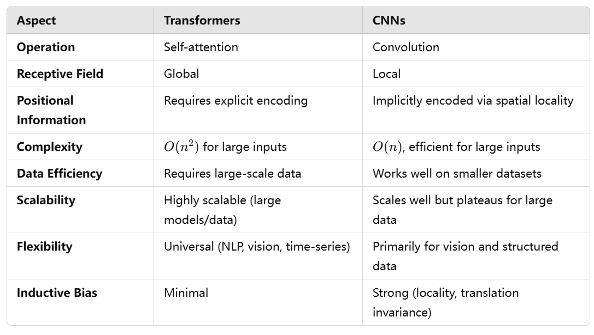


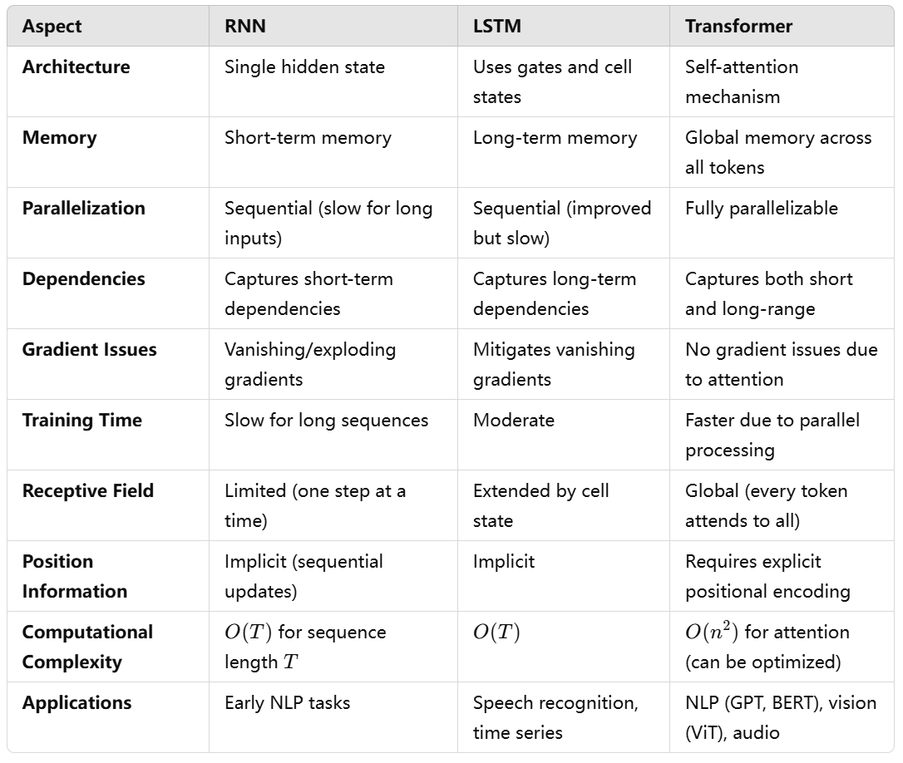


## Structure in Application with Transformer


### **Encoder structure**


Example: Bert

- Why encoder: to solve classification / sentiment or pridiction, that like vision model to 
    - Extract features from input text 
    - Output the **MLP processed** and a label 

- Training: **two stages**
    - How to mask words: randomly masked
        - Some of the masked keep the same, some of replaced by a token `[MASK]` others are randomly replaced by other words 
        - The Bert is trained to **pridict the right words in masked place **

    - first stage: pretraining ⇒ use **self-supervised learning ** that 
        - doesn’t need any label 
        - Large volume of data to learn the connection between word and somehow syntax
        - Usually do a simple work like **pridict a missing text**
            - Which can be done without label 


    - Second stage: finetune for **certain task ⇒ With labels**
        - sentiment: classification of whole input string: use <cls> as a class and compute probabilities for it 
        - Span stage: start and end probabilities for each word
        - Whether an entity or classification of word


- Details about **tokenize **
    - `[CLS]` : at start of each sentence 
        - Sometimes only `CLS` is passed into **FFN: **it does not have meaning, but acts as a classifer
        - Why at the start: `[CLS]` can get **global info **by attention ⇒ by training the embedding and FFN can finish task based on global info from `[CLS]` 

    - `[SEP]` : signal for end of one sentence 
    - `[PAD]` : padding every input tokens to the same length; the embedding for `[PAD]` is `1e-9` to keep their value as 0 (so it will not add noise 

- Modification
    - task: more difficult
        - Sentence order pridiction: whether two sentence exchanged 

    - Mask: more fine-designed mask 
        - If mask one word of a phrase ⇒ mask the whole phrase

    - XLNet(don’t understand)

### **Decoder structure**


Example: **GPT model**

- Why decoder: next word pridiction
    - Encoder is not needed 
    - few-shot: given a lot of context will learn general rule in data ⇒ flexible

- How to do that: a Bayesian pridiction
    - language model: given the previous word and pridict the next word 
    - What we do in GPT: training the model the **maximize log of probability of each position**
        - log P(s1, s2, s3, s4 … sn) = log(s1) + log(s2 | s1) + log(s3 | s2, s1) … 
        - An **Autoregressive generation**: pridict word by word ⇒ pridicted word will by treated as input and pridict next ⇒ don’t need to pridict all at a time 


- Used transformer: self-masked transformer
    - Why: for causal problem, the pridiction / result can not be “hinted” by the future information
    - How: mask the info after the pridicted string ⇒ mask k and v
        - As we mask the Score matrix, result will be 0 ⇒ equals to mask k and v
        - Actually: mask k ⇒ implementation 
```math
Causual \; Score = softmax(Score + M) = \frac{e^{Score}e^{M}}{\sum{}e^{Score}e^{M}} \\ M_{ij} = -\infty \; \; if \; j > i \; \; else \; 0
```


### **Encoder-decoder **


Example: **seq 2 seq generation: translation **

- Why encoder: from the **whole sentence of given sequence extracted features**
- Why decoder: Need to **pridict sequence**
- How to do that: 
    - Encoder: a self attention + feed forward
    - Decoder: a masked self attention 
    - Merge info: a **cross attention where**
        - K, V is encoder
        - Q is decoder
        - Attach a feed forward 


# Large Model 


## **MoE (Mixture of Exprets)**


### **Basic Version**


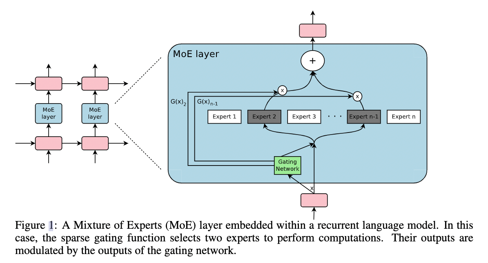


- Train **network + gate + FFN for each expert **to choose right expert network for different input 
    - Exaggerate knowledge stored in network 
    - Accelerate inference

- Task: language 
    - input: tokens / sequence 
    - Model: Network + n * FFN + gate projection 
    - Each token ⇒ input to gate ⇒ output a **sparse vecotor of expert choosen list **⇒ Weighted sum of selected experts’ output 

- How to train 
    - A sparse selection: only use the **topk value **from all experts
    - Unbalanced training of experts: the selected will always selected, others are ignored
        - Add random noise before selecting ⇒ some may randomly selected
        - Add a balance loss related to **variance of usage**
            - large variance: some are frequently used while others are not 
            - small variance: all experts are used with similar times ⇒ better 
```math
L_{importance} = \omega_{important} \cdot [coefficient\ variance(\sum G(x))]^2
```


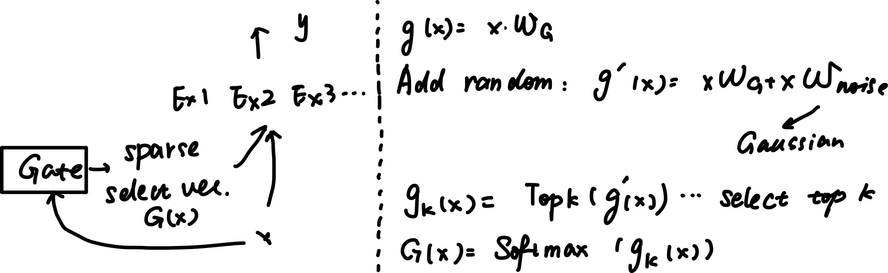


- Challenge in application 
    - Needs **diverse data**
    - in multi-modality: can not converge, needs too many data, gate is not enough for “**multi-modal” **

### Transformer-extended


- Used to extend the number of parameters: replace some FFNs with MoE
    - The number of experts each time + how does each expert selected varies 

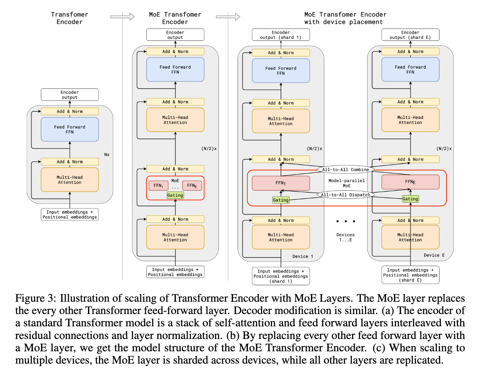


- Used for faster / distilled / less parameters 
    - When compress model ⇒ acc drop ⇒ add MoE to decrease impact 
        - Share Attn, not share normalization and Experts

    - Distill model: given a **trained-model** ⇒ define the **importance of FFN neurons **based on weights ⇒ Convert FFN to multiple experts, each expert neurons based on the importance of them 
        - Very important: all experts has such neurons 
        - Less important: assign 
        - No important: discard


### MoE in Large Model


- Achieve larger model with same **inference computation resorces**
    - Because only `1/n` or `2/n` experts(FFN) modules are used during inference
    - Multi-task: different expert for different task 

- Typical MoE in Large Model: **Swich Transformer **
    - Structure
        - Router: like gating ⇒ output the **score of expert** ⇒ only use **one expert **
        - Replace ALL FFN ⇒ sparse MoE
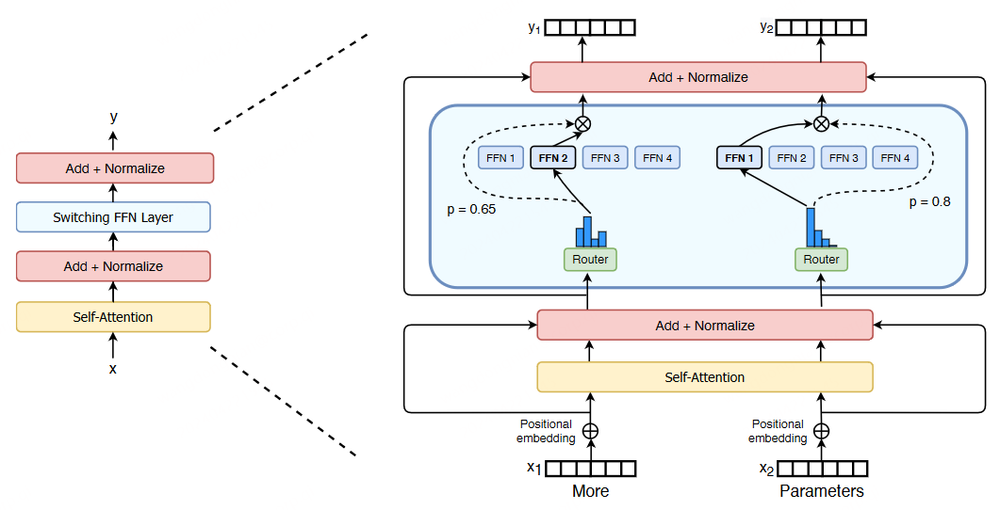


    - Potential challenge
        - Distributed training: 
            - In each device, each expert will excute different batches ⇒ how to know the **batchsize? ** ⇒ The tokens are **assigned to different devices **⇒ make sure enough space for a batch in worst case 
            - Set a `capacity factor` to prevent too many tokens in one device
            - Batch size = Tokens per batch / Experts * `capacity factor` 

        - Balanced training:
            - Make sure each experts trained with **balanced data **
            - load = P(token → expert i ) * ratio(token → expert i) ⇒ loss = sum(all expert loads) * N 
            - Ideally, the loss = 1 

        - Overfit for some task: because it is too sparse: drop out for expert 
        - Faster + keep stable: Mix precision (fp32 for router
        - Data parallel(don’t understand)


## Fine-tuning (Adaptor + LoRA series)


### PEFT: Parameters efficient fine-tuning


- Freeze the pre-trained model + fine-tunine **certain layer **to adopt to new task 
- Catagory
    - Add more parameters: adaptor / add prompt 
    - Select some parameters to update 
    - Reparametrization: LoRA

- Typical method
    - Selective Layer tuning 
    - Adaptor (IP-adaptor .etc): add small-scale FFN **between each layer **
    - Sparse fine-tuning: select **most related parameters **to fine-tune
    - LoRA
    - Task-specific head: add a specific layer as a head 

### **LoRA **


- Decomposite A large matrix into **multiplication of two smaller matrix**
    - Only a lower rank is representable (e.g: using PCA can find a lower rank mat)
    - Updated matrix can become update insert new parameters
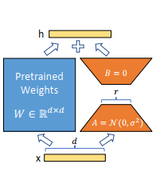


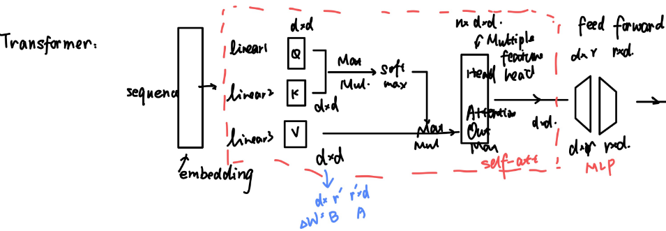


- add into **transformer’s attention module**
    - freeze MLP module
    - plugin in self-attention: q, k, v, o(output matrix)

- hyper-parameters
    - r: rank r, r ↑ ⇒ features better
    - alpha: updated speed

**AdaLoRA(Skip)**

### **QLoRA**


- Finetune a model after **quantized it to 4 bits **and insert a LoRA model to fine-tune for the new task 
```math
Output = X \cdot W_{4-bits\ quantized} + AB(LoRA)
```


- The key is to **quantize with min. performance drop **
    - NF4 bits are used: it is optimzed for **normal distribution ⇒ **key is when it quantized, it does use a **unique distribution (**devide the distribution evenly), but keep every **quantize bin has the same weights number **
    - double quantization: after quantize, we will have scale and zero for all quantized parameters ⇒ we will also **quantize these constants **
    - Optimze for memory by (paged memory) skiped 

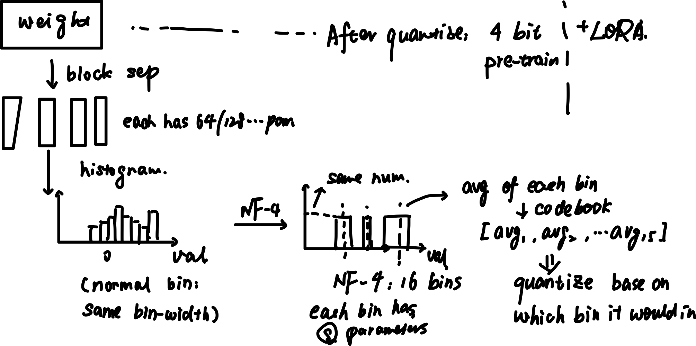


### **Adaptor**


- Freeze the pre-trained model + train the **inserted module**
- Always inserted **after feed-forward layer**
- Inserted module: linear `down` projection → non linearity → linear `up` projection 
    - down: d dims ⇒ m dims ( m << d)

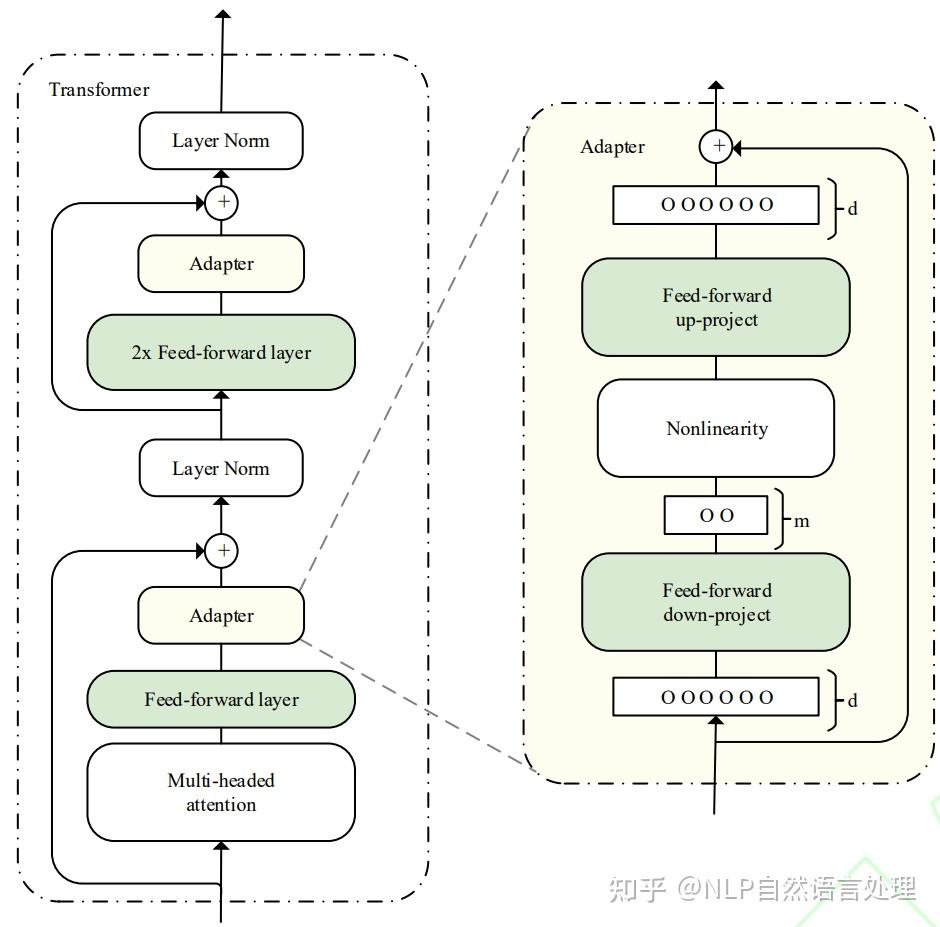


### **Adaptor fusion**


- fuse **multiple learned adaptor **through output to a fusion module
    - `q`: output of **original transformer**
    - `k,v`: output of different tasks

- By original transformer: info extract 
- By added Adaptor: info merge
- Always used to 
    - fuse info over 
        - different modality 
        - different task 
        - different “instruction”


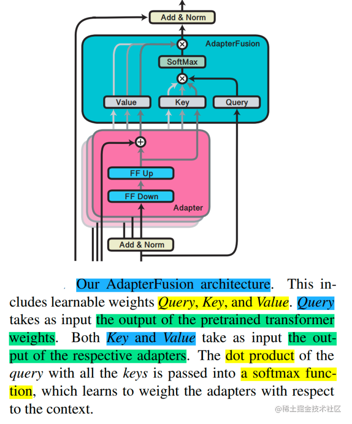


### **Instruct Tuning**


- Train the **pre-trained **model on **instruction tasks**
    - instruction means the input has **certain format: **like the output must follow **certain rules ⇒ are labeled data **that always **generated **by LLM
    - the model will have more **fit natural human habbits **
    - Better align input features with **language embeddings**

- Always used in 
    - ChatBot: to make them like human
    - Multi-modal task: to align different modality
    - task transfer: when the two model has **different “habbit”**

- How to train: **supervised training **
    - input: instruction + input (other embedding) / text
    - output: like language model: **causual token pridiction**
        - Generate the sequence from **left to right: **
```math
Max(P_{t|t-1, ...0}) \; \; \; L = \sum _{t \ after "output"}cross\;entropy(t)
```


```shell
Input: 
"### Instruction: Describe the image\n### Input: [image-embeddings or caption]\n### Output:"
Target: 
"A man is riding a horse."
For model: continue input seq after "output" 
```


### **Prompt Tuning / soft prompts**


- Train an **appended text embedding ** to the computed original embeddings
- How to implement
    - Freeze the original model
    - learnable parameters: a set of **tokens or embeddings **⇒ be later **append to the original input embedding **
    - After training, the appended embeddings acts like **a guide head **that helps finish the **new task **

- Used for 
    - **quick task adaptation**
    - Plug into **generated prompts**, like for RAG
    - When the training data is **small**
    - Append to other **modality input ⇒ **the same kind of tokens can also appended before other embeddings like ViT-embeddings for **few-shot learning**

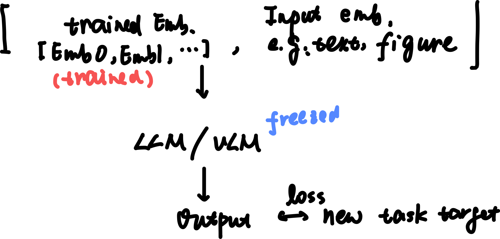


## **RAG: Retrieval-augmented generation**


- Retrieve more **relevent info from external **
- Used to **give gen model “hint”  **⇒ output tokens **added with external retreived results**
- Use **Key-Value search: retrieve most relevent value **
    - Input ⇒ Q embeddings ⇒ Attention score ⇒ Fetch the most relevent Value ⇒ Input toekns + added tokens to Gen model 
